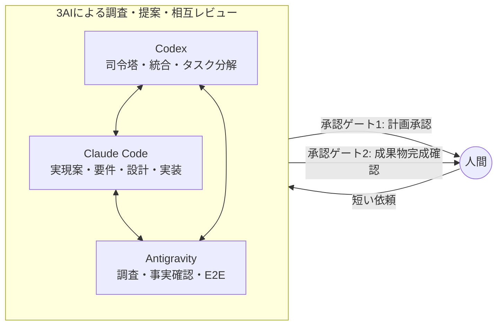

# Triad Orchestrator（3AI開発オーケストレーター）

Codex、Claude Code、Google Antigravity CLI (`agy`) が、それぞれの強みで調査・提案・相互レビューを行い、計画を人間へ提示してから開発へ進むローカル基盤です。人間はVS CodeのCodexまたはClaude Code拡張チャット、あるいはAntigravity CLIへ自然言語で依頼します。

## 役割と実行境界

- Codex：司令塔、独立評価、複数案の統合、計画への統合、人間への提示、タスク分解
- Claude Code：要求・制約分析、実現案、統合方針の独立レビュー、要件定義、設計、主力実装
- Antigravity：公式情報・競合の調査、提案の事実確認、設計前提の実地確認、ブラウザE2E
- 人間：計画承認、成果物完成確認、承認済み計画の変更、リリース、push、デプロイ、破壊的DB操作の最終判断



AI CLIとOAuth資格情報はWSLホストに置きます。対象アプリの依存関係、ビルド、起動、テストは対象リポジトリのDocker Compose内で実行します。

## 配置と利用の前提

本リポジトリは、WSL上へGitクローンしてソースツリーから直接使うCLIです。常駐サービスとして起動したり、対象アプリケーションへ本体をコピーしたりはしません。オーケストレーターと対象アプリケーションは、次のように別のGitリポジトリとして配置します。

```text
<workspace>/
├── triad-orchestrator/  # 本リポジトリ
└── my-app/              # 開発対象。triad-newで作成可能
```

`bin/triad`が既存アプリケーションのタスクを操作し、`bin/triad-new`が新しいアプリケーション用リポジトリと最初のタスクを作成します。これらは通常、拡張チャットを担当するAIが内部で実行します。

## 開発の流れ

人間の承認は2回だけです。

1. **計画承認**：3AIが調査・実現案・統合方針・要件・設計とそれぞれの独立レビューを重ね、Codexが1件の計画書へ統合し、Claudeが最終レビューしたところで、初めて計画全体を人間へ提示します。承認されると、その計画の範囲内で実装が進みます。修正が必要なら理由を伝えるだけで、3AIが調査からやり直します。
2. **成果物完成確認**：承認済み計画に沿って実装し、独立コードレビューとビルド・テスト（必要ならE2E検証）がすべて問題なしで揃ったところで、完成した成果物を人間へ提示します。「これでよい」なら完了、「ここを直して」なら承認済み計画は変えずに作り直します。

## 現在の到達点

MVPは以下を実装しています。

- 明示的な状態機械と差し戻し・作り直しループ
- 人間の短い依頼を起点に、3AIが調査・複数案・相互レビュー・要件・設計・計画統合まで進める協議フロー
- 計画承認・成果物完成確認の2ゲートだけで人間を止める設計。ゲート間の要件・設計はAI間レビューで担保する
- Git追跡下の要求・要件・設計・計画・レビュー・証跡・承認記録
- 参考資料から抽出した品質基準・成果物テンプレートのハッシュ付き固定
- 承認対象をSHA-256で固定する人間承認ゲートと、同一タスクへの同時操作を防ぐタスク単位ロック
- 3つのCLIの非対話アダプター、タイムアウト、監査ログ、APIキー環境変数の除去
- Gemini/Antigravity未ログイン時の明示的な縮退運転
- AI実行前後のGit差分検査と、禁止パス違反時の保護領域限定復元
- Docker Compose経由の対象アプリ検証コマンドと、オーバーライドファイル併存の拒否
- Claude成果物のCodexレビュー、Codex重要コードのClaudeレビューを必須化する状態遷移

リモートへのpush、本番デプロイ、破壊的DB操作を実行する機能は意図的に設けていません。

## クイックスタート：VS Codeチャットから依頼する

人間がTriadやGitのコマンドを入力する必要はありません。最初にVS Codeで本リポジトリを開き、CodexまたはClaude Codeの拡張チャットへ依頼します。例えば次のように伝えます。

> `~/workspace`に`my-app`という新しいアプリを作って。最初の要望は「日々のタスクを簡単に管理したい」。Triadで進めて。

チャット担当AIは、環境確認、リポジトリ作成、タスク初期化、各AIの起動、状態遷移、ローカルコミットを担当します。既存アプリケーションなら、対象パスと実現したいことをそのまま伝えます。

> `/path/to/app`にTriadを導入して、「期限切れタスクを目立たせたい」を進めて。

初期化後は対象リポジトリに`AGENTS.md`、`CLAUDE.md`、`GEMINI.md`、`.ai-dev/chat-interface.md`が追加されます。以後、そのリポジトリをVS Codeで開いて「続きを進めて」「この不具合を直して」のように依頼できます。

### 新しいアプリケーションから始める

作りたいものをチャットへ書けば、新しいGitリポジトリと`.ai-dev`を作成します。作成先とプロジェクト名を省略すると、チャット担当AIが`~/workspace`を作成先に、依頼内容から考えた名前をプロジェクト名として提案します。作成時には、本基盤(`triad-orchestrator`)と新しいアプリの両方を1つのウィンドウで見えるようにするVS Codeマルチルートワークスペースファイルがアプリ側に自動生成されます。その完了後、チャット担当AIが別ステップとして限定ラッパー`bin/triad-open-workspace`でVS Codeを開き直します。Codexが解決策を確定しない調査・協議ブリーフを作り、Antigravityの調査、Claudeの実現案、Codexの独立評価、Antigravityの事実確認、Codexの統合、Claudeの要件・設計とその独立レビューを経て、Codexが計画書へ統合し、Claudeが最終レビューするところまで進めます。

### 既存のGitリポジトリで始める

人間は`input/intake.md`の各欄を埋めません。3AIの協議が終わると、チャット担当AIが候補比較、採用方針、選定理由、要件・設計の概要、仮定、リスク、各AIの見解をまとめた計画書を提示します。問題がなければチャットで「承認」、修正が必要なら理由を自然言語で返します。初回タスクでは、基盤の知識と成果物テンプレートも`.ai-dev/guidance/`へ固定されます。

承認待ち状態ではAI実行が停止します。チャット担当AIは、成果物を提示した後の人間の明示回答だけをCLIへ中継し、`vscode-chat`という確認経路を承認記録へ保存します。AIが自分の判断で承認することはできません。

チャット経路は提示対象の差し替えをハッシュで検出しますが、人間の発言そのものをCLIが暗号学的に証明する仕組みではありません。チャット担当AIがリポジトリ指示を守ることを信頼するローカル運用向けです。侵害されたAIからも承認を保護する必要がある場合は、保守用の対話端末経路を使用します。

詳しい運用は[運用手順](docs/platform/operations.md)、設計判断は[アーキテクチャ](docs/platform/architecture.md)、コード単位のクラス図・フローチャート・シーケンス図は[実装設計書](docs/platform/design/index.md)を参照してください。文書全体の構成は[文書案内](docs/README.md)にまとめています。

## 基盤自身のテスト

拡張チャットへ「基盤のテストを実行して」と依頼してください。チャット担当AIは`docker compose run --rm test`を実行します。ホスト側での`python -m unittest`は開発時の補助に限り、正式な検証入口はDocker Composeです。
