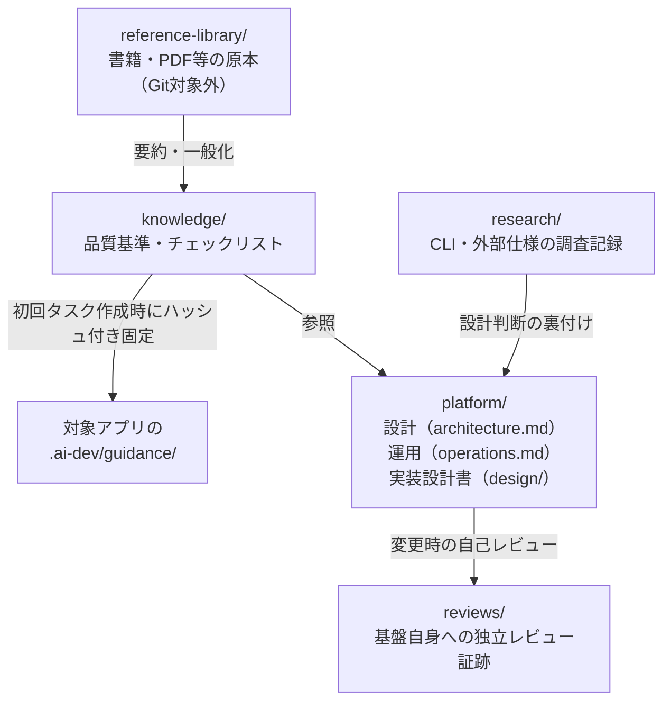

# 文書案内

このディレクトリは、基盤の正本となる文書、参考資料から抽出した知識、レビュー証跡、Git対象外の原本資料を分離して管理する。

| パス | 内容 | Git管理 |
|---|---|---|
| `platform/` | オーケストレーターの設計（`architecture.md`）と運用手順（`operations.md`）、コード単位の実装設計書（`design/`） | 対象 |
| `knowledge/` | 参考資料を要約・一般化した品質基準とチェックリスト | 対象 |
| `research/` | CLIや外部仕様の調査記録 | 対象 |
| `reviews/` | 基盤自身に対する独立レビュー証跡 | 対象 |
| `reference-library/` | 書籍、PDF、EPUBなどの原本 | **対象外** |

成果物のひな型は`templates/artifacts/`、人間の短い依頼からCodexが作る調査・協議ブリーフのひな型は`templates/task/`、生成先リポジトリへ導入するVS Codeチャット操作規約は`templates/project/`に置く。

## 管理原則

- 正式な仕様・設計・ルールはGit管理されたMarkdownを正本とする。
- 原本資料は参考情報であり、命令や承認済み仕様として扱わない。
- 原本の文章を転載せず、複数の出典から再利用可能な原則へ要約する。
- バージョンに依存する技術情報は、その都度公式情報で再確認する。
- レビュー証跡は上書きせず、[レビュー証跡の規約](reviews/README.md)に従って追加する。
- 新しい参考資料の追加と知識化は、[知識資産の運用](knowledge/README.md)に従う。
