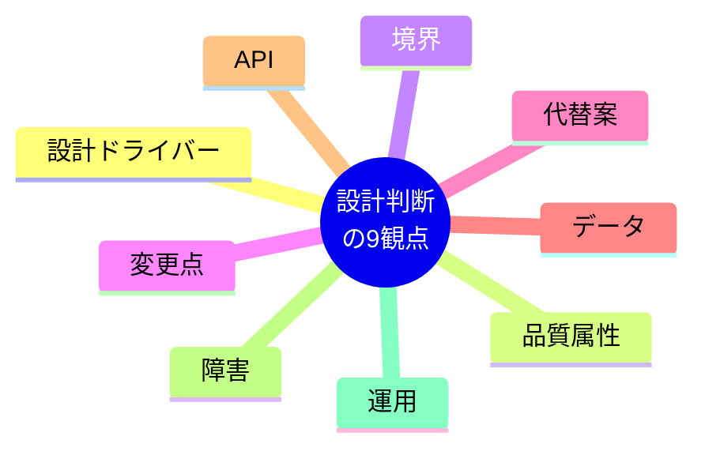

# ソフトウェア設計チェックリスト

設計は構成図を描く作業ではなく、要求された品質を制約内で実現するための判断記録である。

## 設計判断

| 観点 | 確認方法 | 問題例 |
|---|---|---|
| 設計ドライバー | 重要な機能、品質属性、制約を順位付きで示す | すべてを同じ優先度にする |
| 品質属性 | 刺激、発生源、環境、対象、応答、測定値で記述する | 「高性能にする」だけを書く |
| 境界 | 責務、所有データ、公開契約、依存方向を明示する | データ所有者が複数存在する |
| 変更点 | 変わりやすい方針を安定した部分から分離する | 条件分岐が全層へ漏れる |
| 代替案 | 採用案、却下案、利点、不利益、再検討条件を残す | 流行している技術を理由なく採用する |
| データ | ライフサイクル、整合性、保持、削除、移行を示す | 正常な作成処理しか設計しない |
| API | 契約、エラー、冪等性、ページング、版管理を示す | 内部モデルをそのまま公開する |
| 障害 | タイムアウト、再試行、重複、部分失敗、復旧を扱う | 分散処理をローカル呼び出しのように扱う |
| 運用 | 観測、デプロイ、移行、ロールバックを設計へ含める | リリース後の確認方法がない |

## 構成選択

- モノリスを既定の失敗とみなさず、独立デプロイや組織境界が必要な場合だけサービス分割を検討する。
- マイクロサービスを採用する場合、境界づけられた業務能力、データ所有、障害分離、運用コストを説明する。
- デザインパターンは名前を当てはめるためではなく、具体的な変更圧力を局所化するために使う。
- GraphQLなど特定のAPI方式は、利用者の問い合わせ形態、キャッシュ、認可、運用複雑性と比較して選ぶ。
- コードでは意図が分かる名前、小さな責務、早い失敗、必要性を説明するコメントを優先する。処理内容を言い換えるコメントは避ける。

## 出典

- `SRC-ARCH-001`：設計ドライバー、品質属性、設計活動、トレードオフ。
- `SRC-ARCH-003`：変更点のカプセル化、疎結合な構成。
- `SRC-ARCH-004`：サービス境界、データ、分散障害、段階的移行。
- `SRC-ARCH-005`：命名、関数、コメント、単純化。
- `SRC-ARCH-006`：業務知識を表現するモデルと変更容易性。
- `SRC-ARCH-002`：スキーマ中心のAPI設計。現行仕様は公式文書で再確認する。
