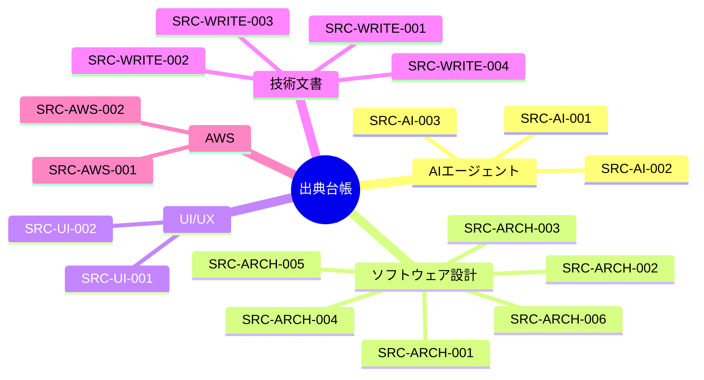

# 出典台帳

原本はすべて`docs/reference-library/`配下にあり、Git管理対象外である。出典IDは知識文書から参照するための安定識別子で、原本ファイル名を変更しても再利用する。

| 出典ID | 書名 | 分野 | ローカル原本 | 主な適用先 | 鮮度 |
|---|---|---|---|---|---|
| `SRC-AI-001` | 実践 AIエージェント開発 | AIエージェント | `ai-engineering/practical-ai-agent-development.pdf` | 役割分離、協調、評価 | 原則中心 |
| `SRC-AI-002` | 生成AIデザインパターン | AIアプリケーション | `ai-engineering/generative-ai-design-patterns.pdf` | パターン、ガードレール、評価 | 技術更新に注意 |
| `SRC-AI-003` | LLMのプロンプトエンジニアリング | プロンプト設計 | `ai-engineering/llm-prompt-engineering.pdf` | 指示、文脈、出力契約 | モデル更新に注意 |
| `SRC-ARCH-001` | Design It! | ソフトウェア設計 | `software-architecture/design-it.pdf` | 品質属性、設計判断、トレードオフ | 原則中心 |
| `SRC-ARCH-002` | 初めてのGraphQL | API設計 | `software-architecture/learning-graphql.pdf` | APIスキーマ、問い合わせ境界 | 公式仕様を再確認 |
| `SRC-ARCH-003` | Head Firstデザインパターン 第2版 | オブジェクト設計 | `software-architecture/head-first-design-patterns-2e.pdf` | 変更点の分離、構成 | 原則中心 |
| `SRC-ARCH-004` | マイクロサービスアーキテクチャ 第2版 | 分散システム | `software-architecture/microservices-architecture-2e.pdf` | サービス境界、運用、移行 | 実装技術は更新注意 |
| `SRC-ARCH-005` | リーダブルコード | コード品質 | `software-architecture/readable-code.pdf` | 命名、関数、コメント、理解容易性 | 原則中心 |
| `SRC-ARCH-006` | 現場で役立つシステム設計の原則 | システム設計 | `software-architecture/system-design-principles.pdf` | ドメインモデル、変更容易性 | 原則中心 |
| `SRC-UI-001` | オブジェクト指向UIデザイン | UI/UX | `ui-ux/object-oriented-ui-design.pdf` | オブジェクト、操作、画面構成 | 原則中心 |
| `SRC-UI-002` | UIデザインの教科書 新版 | UI/UX | `ui-ux/ui-design-textbook-revised.pdf` | 認知、一貫性、階層、デバイス差 | トレンドは更新注意 |
| `SRC-WRITE-001` | 大事な順に身につく 説明の「型」 | 説明技術 | `technical-writing/explanation-patterns.pdf` | 結論先出し、情報順序 | 原則中心 |
| `SRC-WRITE-002` | ITエンジニアのためのMarkdown実践入門 | Markdown | `technical-writing/markdown-for-engineers.pdf` | 見出し、表、コード、生成AI時代の文書 | ツール仕様は更新注意 |
| `SRC-WRITE-003` | 技術者のためのテクニカルライティング入門講座 第2版 | 技術文書 | `technical-writing/technical-writing-for-engineers-2e.pdf` | 読み手、目的、構成、推敲 | 原則中心 |
| `SRC-WRITE-004` | エンジニアのための文章術 再入門講座 新版 | 技術文書 | `technical-writing/writing-for-engineers-reintroduction-revised.pdf` | 状況別文書、論理構造、具体性 | 原則中心 |
| `SRC-AWS-001` | ゼロからわかるAmazon Web Services超入門 改訂新版 | AWS | `cloud/aws/aws-introduction-revised.pdf` | クラウド基礎、責任分界 | 公式情報を必ず再確認 |
| `SRC-AWS-002` | 図解即戦力 Amazon Web Servicesのしくみと技術がこれ1冊でしっかりわかる教科書 改訂2版 | AWS | `cloud/aws/aws-technology-guide-2e.pdf` | サービス選択、構成、運用 | 公式情報を必ず再確認 |

## 出典利用上の注意

- 台帳への登録は、その内容を基盤のルールとして自動採用することを意味しない。
- `技術更新に注意`または`公式情報を再確認`の資料は、概念理解に使い、現在の仕様値や推奨構成の根拠には単独で使わない。
- 知識文書には、関連する出典IDと、参照した章・主題を記録する。
