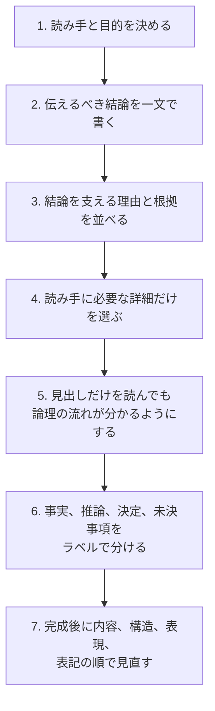

# 技術文書チェックリスト

文書の品質は文章量ではなく、読み手が正しく判断・実行できるかで評価する。

## 構成

1. 読み手と目的を決める。
2. 伝えるべき結論を一文で書く。
3. 結論を支える理由と根拠を並べる。
4. 読み手に必要な詳細だけを選ぶ。
5. 見出しだけを読んでも論理の流れが分かるようにする。
6. 事実、推論、決定、未決事項をラベルで分ける。
7. 完成後に内容、構造、表現、表記の順で見直す。

## 表現

| 観点 | 推奨 | 避ける例 |
|---|---|---|
| 一文一義 | 一文では一つの判断だけを伝える | 条件と例外を接続詞で延々と連結する |
| 主体 | 誰が何をするかを明示する | 「対応される」「実施するものとする」の乱用 |
| 具体性 | 数値、条件、観測方法を示す | 速やかに、適切に、必要に応じて |
| 用語 | 一つの概念に一つの名称を使う | ユーザー、顧客、利用者を無差別に混在させる |
| 見出し | 内容を予測できる具体的な名詞句にする | その他、補足、詳細 |
| 箇条書き | 並列関係と文末をそろえる | 原因、手順、結論を同じ一覧に混ぜる |
| 表 | 同じ比較軸を持つ複数項目に使う | 長文説明をセルへ詰め込む |
| コード | 言語、前提、実行結果、安全性を示す | 破壊的コマンドだけを説明なしで載せる |
| リンク | リンク先の内容が分かるラベルを使う | 「こちら」を連続して使う |

AIが作成した文書も、人間または独立したAIが、目的適合性、事実性、欠落、曖昧さをレビューする。流暢さを正確さの証拠にしない。

## 出典

- `SRC-WRITE-001`：重要な内容から伝える説明構造。
- `SRC-WRITE-002`：Markdownの見出し、一覧、表、コード、リンクの使い分け。
- `SRC-WRITE-003`：ロジカルライティング、読み手分析、一文一義、推敲、レビュー。
- `SRC-WRITE-004`：IT現場の状況別文書、論理的な文章構造、具体的な伝達。
