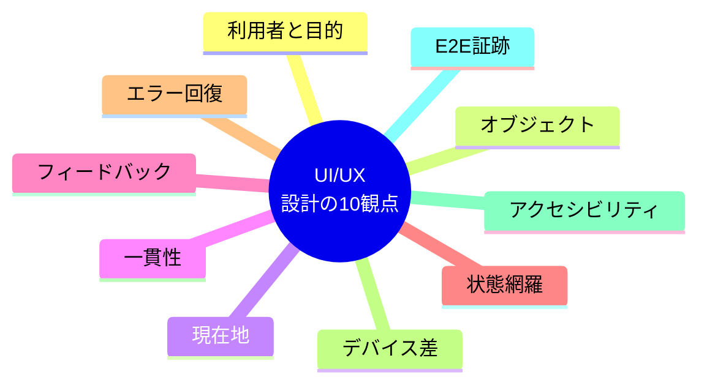

# UI/UXチェックリスト

UIは画面一覧から始めず、利用者が扱う対象、目的、操作、状態から設計する。

| 観点 | 確認方法 | 問題例 |
|---|---|---|
| 利用者と目的 | 主な利用者、利用状況、達成したい結果を示す | 「一般ユーザー」だけで終える |
| オブジェクト | 利用者が認識する対象、属性、関係、主要操作を定義する | 画面名だけで情報構造を作る |
| 現在地 | 選択中の対象、階層、戻り先が分かる | モーダルを閉じるまで文脈を失う |
| 一貫性 | 同じ概念、操作、状態に同じ語と表現を使う | 保存と登録が同じ意味で混在する |
| フィードバック | 操作受付、処理中、成功、失敗を適切な時点で示す | 送信後に無反応になる |
| 状態網羅 | 初期、空、読み込み中、部分表示、エラー、権限不足を設計する | 正常データがある画面しか作らない |
| エラー回復 | 原因、影響、次の行動、入力保持を示す | 「エラーが発生しました」だけを表示する |
| デバイス差 | 画面幅、入力手段、表示密度、性能差を確認する | PCのホバー操作を必須にする |
| アクセシビリティ | キーボード、フォーカス、意味構造、代替テキスト、コントラストを検証する | 色だけで状態を伝える |
| E2E証跡 | 操作手順、期待、実測、画像、環境、再現性を残す | スクリーンショットだけを合格証跡にする |

UIの具体的な規格値やブラウザ挙動は変化するため、実装時に現行の公式アクセシビリティ基準と対象ブラウザ仕様を確認する。

## 出典

- `SRC-UI-001`：オブジェクト、ビュー、ナビゲーション、利用者の操作を中心にしたUI設計。
- `SRC-UI-002`：物理的制約、認知特性、一貫性、階層、ナビゲーション、マルチデバイス。
