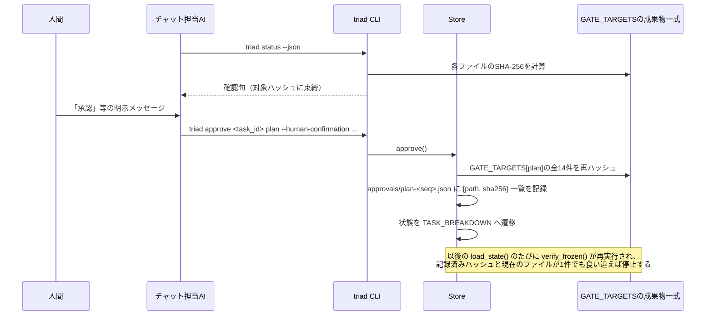
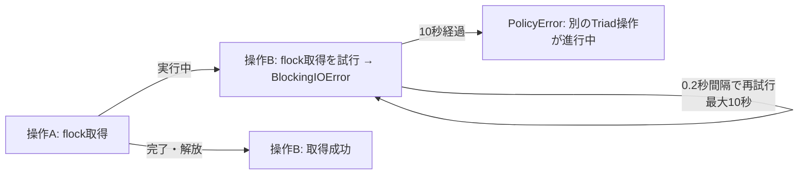
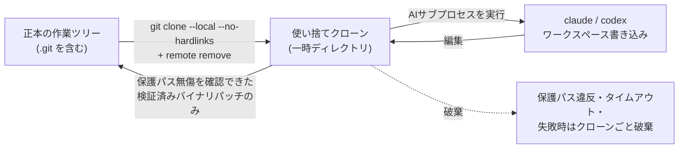

# アーキテクチャ

コード単位の実装設計（クラス図・フローチャート・詳細シーケンス）は[実装設計書](design/index.md)にまとめている。本文書は「なぜこの設計にしたか」という判断の根拠を扱う。

## 基本方針

各アプリケーションのGitリポジトリを、AI間の会話場所ではなく共有台帳として使う。非公開のCLIセッション、内部記憶、チャット履歴は、意図的に正本として扱わない。すべての引き継ぎは、`.ai-dev/tasks/<task-id>/`配下で追跡される調査、提案、相互レビュー、要件、設計、計画、判断、検証成果物のいずれかに結び付ける。途中の思考や未加工の会話をGitへ保存せず、次の担当と人間の判断に必要な節目の成果物だけを記録する。

基盤側で採用した知識基準と成果物テンプレートは、対象アプリケーションの初回タスク作成時に`.ai-dev/guidance/`へ複製し、ファイルごとのSHA-256を`manifest.json`へ記録する。同じリポジトリの後続タスクでは既存スナップショットを暗黙に更新せず、状態読み込み時に構成とハッシュを検証する。これにより、将来参考資料が追加されても、進行中タスクへ未レビューの規則が混入しない。

オーケストレーション基盤とアプリケーションのリポジトリは分離する。人間向けの操作面はVS CodeのCodexまたはClaude Code拡張チャット、あるいはAntigravity CLIとし、チャット担当AIが内部のCLI操作を引き受ける。本基盤はホストにインストールされたOAuth対応CLIを起動し、OAuth認証情報をコンテナへコピーしない。アプリケーションの依存関係と、すべてのビルド・起動・テストコマンドは、アプリケーション側のDocker Composeインターフェース内に閉じ込める。

## なぜCLIサブプロセス方式なのか

人間の入口はVS Code拡張チャット2種（Codex／Claude Code）と、生のAntigravity CLI端末という3種類の異質な実行環境になり得る。これら全てで一様に使える操作面は、引数を渡して起動するだけのプレーンなCLIだけである。MCPサーバとして操作を公開する方式も検討したが、（1）常駐プロセスの生存管理という、単一ユーザーのローカルツールが避けたい問題を持ち込む、（2）AntigravityのCLI設定はユーザー単位のパスにあり対象リポジトリ経由でGit共有できないという非対称性を、MCPサーバ設定の共有問題として移動させるだけで解消しない、（3）ターミナルで直接`agy`を使う場面はチャット拡張のホストを介さないため、MCPクライアントとして機能する保証がない、という理由で採用しなかった。`triad status --json`が返す構造化された`human_actions`が、MCPツール呼び出しの型付き応答に相当する役割を、プロトコルや常駐プロセスなしに果たしている。

## 状態遷移

Triadは3AIの協議・提案・レビューを重ねた上で、人間の承認をちょうど2回だけ求める。1回目は実装に入る前の**計画承認**、2回目は完成した成果物に対する**成果物完成確認**である。要件・設計は計画マクロフェーズの内部でAI間レビューを経るが、それぞれを個別の人間承認対象にはしない——3AIの統合結果である計画書1件を、人間が一度で判断できる形にまとめて提示する。

```mermaid
stateDiagram-v2
    [*] --> INTAKE

    state "計画マクロフェーズ（全てAI主体。ここでは人間を止めない）" as Planning {
        INTAKE: Codex。解決方法を決めず、短い依頼を調査・協議ブリーフへ整理
        INTAKE --> RESEARCH : success

        RESEARCH: Antigravity。公式情報・競合・技術制約を調査（明示的なSKIP可）
        RESEARCH --> SOLUTION_PROPOSAL : success / skip

        SOLUTION_PROPOSAL: Claude。要求・制約を踏まえて複数の実現案を比較
        SOLUTION_PROPOSAL --> PROPOSAL_REVIEW : success

        PROPOSAL_REVIEW: Codex。独立見解を組み立て、Claude案を批判的にレビュー
        PROPOSAL_REVIEW --> PROPOSAL_FACT_CHECK : approve
        PROPOSAL_REVIEW --> SOLUTION_PROPOSAL : needs_changes

        PROPOSAL_FACT_CHECK: Antigravity。外部事実と現行仕様を再確認（明示的なSKIP可）
        PROPOSAL_FACT_CHECK --> SYNTHESIS : success / skip

        SYNTHESIS: Codex。候補比較、採用する方針、採否理由、仮定、リスクを決定
        SYNTHESIS --> SYNTHESIS_REVIEW : success

        SYNTHESIS_REVIEW: Claude。統合方針の正確性・公平性・実現可能性を独立レビュー
        SYNTHESIS_REVIEW --> REQUIREMENTS : approve
        SYNTHESIS_REVIEW --> SYNTHESIS : needs_changes

        REQUIREMENTS: Claude。検証可能な要件を定義
        REQUIREMENTS --> REQUIREMENTS_REVIEW : success

        REQUIREMENTS_REVIEW: Codex
        REQUIREMENTS_REVIEW --> DESIGN : approve
        REQUIREMENTS_REVIEW --> REQUIREMENTS : needs_changes

        DESIGN: Claude。アーキテクチャ、API、データ、運用、テストを設計
        DESIGN --> DESIGN_RESEARCH : success

        DESIGN_RESEARCH: Antigravity。設計上の外部前提を実地確認（明示的なSKIP可）
        DESIGN_RESEARCH --> DESIGN_REVIEW : success / skip

        DESIGN_REVIEW: Codex
        DESIGN_REVIEW --> PLAN : approve
        DESIGN_REVIEW --> DESIGN : needs_changes

        PLAN: Codex。統合方針・要件・設計・各レビュー判定・リスク・仮定を1件の計画書へ統合
        PLAN --> PLAN_REVIEW : success

        PLAN_REVIEW: Claude。計画書一式の完全性・整合性・提示妥当性を独立レビュー
        PLAN_REVIEW --> AWAITING_PLAN_APPROVAL : approve
        PLAN_REVIEW --> PLAN : needs_changes
    }

    AWAITING_PLAN_APPROVAL: 人間【承認ゲート1】計画書一式を承認または理由付きで差し戻し
    AWAITING_PLAN_APPROVAL --> INTAKE : needs_changes（差し戻し）
    AWAITING_PLAN_APPROVAL --> TASK_BREAKDOWN : approve

    state "成果物マクロフェーズ（計画承認後のビルド・検証。末尾に人間ゲート2）" as Delivery {
        TASK_BREAKDOWN: Codex。承認済み計画を実装タスクへ分解
        TASK_BREAKDOWN --> TASK_PLAN_REVIEW : success

        TASK_PLAN_REVIEW: Claude
        TASK_PLAN_REVIEW --> IMPLEMENTATION : approve
        TASK_PLAN_REVIEW --> TASK_BREAKDOWN : needs_changes

        IMPLEMENTATION: 既定は主力実装AI（変更可能）
        IMPLEMENTATION --> CODE_REVIEW : success

        CODE_REVIEW: 実装者ではないAI。Composeの安全性も確認
        CODE_REVIEW --> BUILD_TEST : approve
        CODE_REVIEW --> FIX : needs_changes

        FIX --> CODE_REVIEW : success

        BUILD_TEST: レビュー後に限りDocker Composeで実行
        BUILD_TEST --> E2E_VERIFY : success
        BUILD_TEST --> FIX : fail

        E2E_VERIFY: Antigravity（明示的なSKIP可）
        E2E_VERIFY --> DELIVERY_PREP : success / skip
        E2E_VERIFY --> FIX : fail

        DELIVERY_PREP: Codex。変更内容・検証証跡・既知の制約・残存リスクを統合（実行承認ではない）
        DELIVERY_PREP --> DELIVERY_REVIEW : success

        DELIVERY_REVIEW: Claude
        DELIVERY_REVIEW --> AWAITING_DELIVERY_APPROVAL : approve
        DELIVERY_REVIEW --> DELIVERY_PREP : needs_changes
    }

    AWAITING_DELIVERY_APPROVAL: 人間【承認ゲート2】完成した成果物を承認または作り直しを指示
    AWAITING_DELIVERY_APPROVAL --> FIX : needs_changes（作り直し）
    AWAITING_DELIVERY_APPROVAL --> DELIVERED : approve
    DELIVERED --> [*]
```

全27状態・全遷移を1対1でコード（`triad/model.py`の`TRANSITIONS`）から起こした詳細版と`CHANGE_REQUEST`側路の図は[実装設計書のmodel.md](design/model.md#状態遷移図全状態全遷移)を参照。

`AWAITING_PLAN_APPROVAL`で人間が差し戻す場合、対象ハッシュと理由を記録して`INTAKE`へ戻し、3AIの調査・提案・要件・設計・計画をやり直す。`PLAN_REVIEW`で修正が必要なら`PLAN`へ戻し、Codexは計画書自身とあわせて必要な上流成果物（要件・設計）まで修正した上で計画書を再統合する（差し戻し先を成果物ごとに分岐させる複雑さを避けるための意図的な単純化。既存の各レビューがすべて直前フェーズへの1段階差し戻しである方針を計画統合ステップにも一貫させている）。`AWAITING_DELIVERY_APPROVAL`で人間が「作り直し」を指示する場合は`FIX`へ戻る——承認済み計画自体は変更せず、その範囲内での実装のみをやり直す軽量な差し戻しである。実装後の失敗時も同様に`FIX -> CODE_REVIEW -> BUILD_TEST`の順に戻る。このため、変更されたCompose定義が独立レビュー前に実行されることはない。

計画承認後に承認済み計画自体との矛盾が生じた場合は`CHANGE_REQUEST`へ移り、人間が承認するまで実装を停止する。人間が承認すると、計画承認を無効化して`INTAKE`から3AIの調査・提案をやり直す。計画承認の前（計画マクロフェーズ本体と`AWAITING_PLAN_APPROVAL`自体）は、より軽量な`advance --outcome needs_changes`による差し戻しで足りるため、変更要求の対象にしない。

`DELIVERED`は、判断材料の準備が完了したことだけを意味する。push、デプロイ、本番マイグレーション、マージは実行しない。

## 担当と独立レビュー

| 成果物または作業 | 作成者 | 必須の独立レビュー担当 |
|---|---|---|
| 短い依頼から作る調査・協議ブリーフ | Codex | 後続3AIが具体化 |
| 公式情報・競合調査／提案の事実確認／設計前提の実地確認／実画面検証 | Antigravity | Codexが統合。縮退時のスキップは人間へ提示 |
| 複数の実現案 | Claude | Codexが独立見解と比較してレビュー |
| 3AIの統合方針 | Codex | Claude |
| 要件／設計／アプリケーションの主力コード | Claude | Codex |
| 計画書（統合方針・要件・設計・レビュー結果の統合） | Codex | Claude |
| タスク計画／成果物完成資料 | Codex | Claude |
| Codexが作成した重要なオーケストレーションコード | Codex | Claude |
| 計画・成果物完成の承認 | 人間 | オーケストレーターによるハッシュ検証 |

実装者は`state.json`へ記録する。`CODE_REVIEW`では実装者ではない方のAIを動的に選択し、自作コードの自己レビューを防ぐ。

## 承認の完全性

計画承認・成果物完成確認の承認記録には、対象となる全成果物のSHA-256を保存する。計画承認ゲートでは、調査・実現案・Codexレビュー・事実確認・統合方針・レビュー・要件・レビュー・設計・設計調査・レビュー・計画書・レビューの14件を一式として固定する。以後、状態を読み込むたびに有効な全固定ハッシュを検証する。承認済み成果物が変更または欠落している場合、ワークフローを停止する。対処方法は変更要求（計画承認後）または差し戻し（計画承認前）であり、ハッシュを暗黙に更新してはならない。

AIの出力には独立した`human_decisions`一覧を含める。計画マクロフェーズ（`INTAKE`〜`PLAN_REVIEW`）では、この一覧は必ず空でなければならない——不足情報は仮定・選択肢・リスクとして成果物本文へ明示し、人間には計画承認の1回でまとめて判断してもらう。成果物マクロフェーズでAIが重要な質問を提示した場合は、質問元の成果物ハッシュと結び付いた判断待ち記録をGit上に作成し、チャット担当AIが質問を提示した後の人間メッセージで得たすべての回答を記録するまで、通常の状態遷移を停止する。

`approve`、`approve-change`、差し戻し・作り直し、判断回答は、対話端末とVS Codeチャットの2経路を持つ。チャット経路では、対象成果物と影響を提示した後の別の人間メッセージに明示意思がある場合だけ、チャット担当AIが`status`の確認句を中継する。確認句には対象パスとSHA-256から導出した短いチャレンジを含め、提示後に対象が変化した場合は拒否する。CLIは確認句を検証し、承認・判断記録へ`confirmation_channel: vscode-chat`を保存する。AIアダプターの子プロセスからの呼び出しはどちらの経路でも拒否する。これは単一ユーザーのローカル環境向け運用統制であり、人間の身元やチャット発言を暗号学的に証明するものではない。

チャット確認句は秘密ではなく、チャット担当AI自身も取得できる。この経路が保証するのは提示対象と実行対象の一致であり、人間が実際に発言したことをCLI単体で技術的に証明するものではない。明示意思の判定は、リポジトリ指示を読み込んだVS Code拡張が二段階手順を守るという信頼境界に置く。プロンプトインジェクションや侵害されたチャット担当AIからも承認を保護する必要がある用途では、チャット経路を使用せず、人間が確認句を直接入力する対話端末経路を使う。

判断回答では、判断待ち記録に加えて回答文字列の正規化JSONをSHA-256へ含める。人間の回答を受け取った後、チャット担当AIは回答付きの`status`から確認句を取得する。異なる回答を`decide`へ渡すと確認句が一致せず、判断記録を変更できない。

ゲート承認の実際のハッシュ固定と検証タイミングは次の通り（詳細な実装は[store.md](design/store.md#approve-のフロー)を参照）。

## 同時操作の排他制御

人間が複数のチャット窓口（例：Codex拡張とClaude Code拡張を同じ対象リポジトリで同時に開く）を使う運用を想定しているため、同一タスクへの同時操作というレースが現実的に起こり得る。`Store`は`advance`・`approve`・`request-change`・`approve-change`・`decide`各操作、およびRunnerのワークスペース書き込み・`BUILD_TEST`実行を、タスク単位のアドバイザリロック（`.ai-dev/tasks/<id>/.lock`への`flock`）で直列化する。ロック取得側は最大10秒待機し、それでも取得できない場合は「別のTriad操作が進行中」という明確なエラーで即座に失敗する——無期限に待機したり、ロックなしで暗黙に競合させたりしない。ロックファイル自体はGit追跡対象外とし、`initialize()`が対象リポジトリの`.gitignore`へ`.ai-dev/tasks/*/.lock`を冪等に登録する。

ロック取得から解放までの詳細なシーケンスは[store.md](design/store.md#task_lock-の排他制御)を参照。

## 実行境界

成果物作成フェーズではAIを読み取り専用で実行し、構造化された結果を必須とする。契約対象ファイルを書き込むのはAIではなくオーケストレーターである。プロンプト本文と未加工の会話記録はGitへ保存しない。監査記録には、プロンプトのハッシュ、フェーズ、AI、実行時間、終了コード、タイムアウトの有無、構造化出力の成否を保存する。

実装・修正フェーズだけはワークスペースへの書き込みを許可する。正本の作業ツリーがクリーンであることを必須とするが、成果物を作るAI子プロセスがその作業ツリーを直接編集することはない。オーケストレーターは使い捨てのローカルクローンを作成し、リモート設定を削除し、ハッシュ付きの引き継ぎ情報をコピーして、その中でAIを実行する。保護対象の内容と変更パスを検証した後、検証済みのバイナリ対応ソースパッチだけを正本の作業ツリーへ適用する。保護対象が変更された場合は、クローンとともにパッチ全体を破棄する。Gitコミットは人間、CLI、またはVS Codeのチャット担当AIがオーケストレーターとして統合時に行い、成果物作成者をtrailerへ記録する。

実行境界の詳細な処理順序（保護ファイルのスナップショット・ドリフト検出を含む）は[runner.md](design/runner.md#_workspace_run使い捨てクローンによる実行境界)を参照。

Codexでは、ワークスペース書き込みに、未信頼コマンドの承認、コマンドのネットワーク利用の明示的拒否、Web検索の無効化、ユーザー設定の無視、一時セッションを組み合わせる。OpenAIのサンドボックスも`.git`を再帰的に保護する。さらに使い捨てクローンを用いるため、正本の`.git`は常にAIのワークスペース外にある。Claudeには明示的なツール許可一覧と、同じクローン境界を適用する。

Docker Compose検証もリモート設定のない使い捨てクローンで実行する。環境からAPI、クラウド、SSH、Dockerコンテキストの認証情報を除去し、固有のComposeプロジェクト名を使用する。コンテナ起動前に、サービスの環境変数ファイルを読み込まずにComposeモデルを解決する。ホスト外部へのバインド、外部ビルドコンテキスト、Dockerソケットのマウント、特権モード、ホスト名前空間、デバイス、追加ケイパビリティ、制限なしのセキュリティ設定、外部の`include`・`extends`・`env_file`参照は拒否する。加えて、`compose.override.yaml`等のオーバーライドファイルがメインのComposeファイルと併存する場合は自動テスト自体を拒否する——`docker compose config`が解決した後のモデルに対する安全性検証はオーバーライドで注入された危険な設定も検出できるが、生キー走査による`include`/`extends`/`env_file`の事前検査はメインファイル1つしか読まないため、多重定義による見落としの芽を早期に摘む。

## 失敗時の方針

- 各プロセスには実時間の上限を設ける。超過時は`SIGTERM`を送り、猶予期間後に`SIGKILL`を送る。
- 未加工の出力にはメモリ上限を設け、スキーマ検証失敗時には保存しない。
- 読み取り専用の成果物作成フェーズでは、タイムアウト以外のプロセス失敗またはスキーマ失敗時に1回だけ再試行できる。ワークスペース書き込みフェーズとタイムアウトした呼び出しは自動再試行しない。
- Antigravityが存在しない、または未ログインの場合を成功として扱わない。人間またはオーケストレーターが`skip`を記録し、その事実をタスクの状態・履歴へ残す。
- 作業ツリーに未コミット変更がある場合は実装・修正フェーズとBUILD_TESTを停止し、既存のユーザー変更とAIの変更が混同されることを防ぐ。
