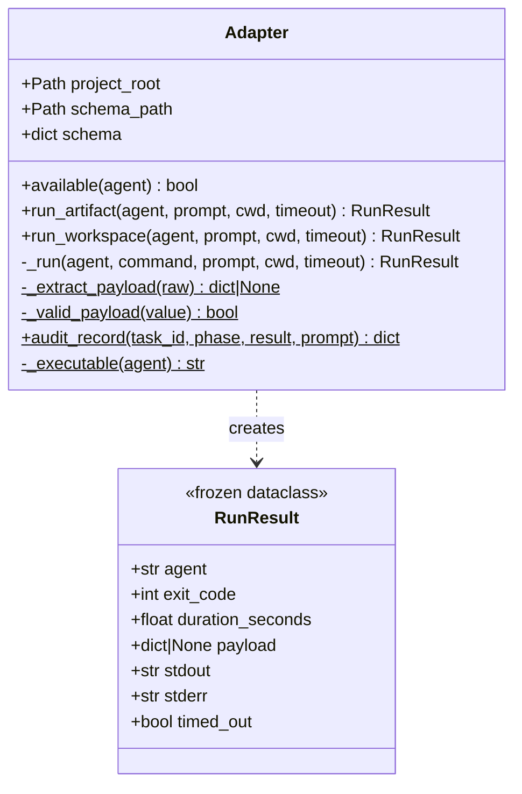
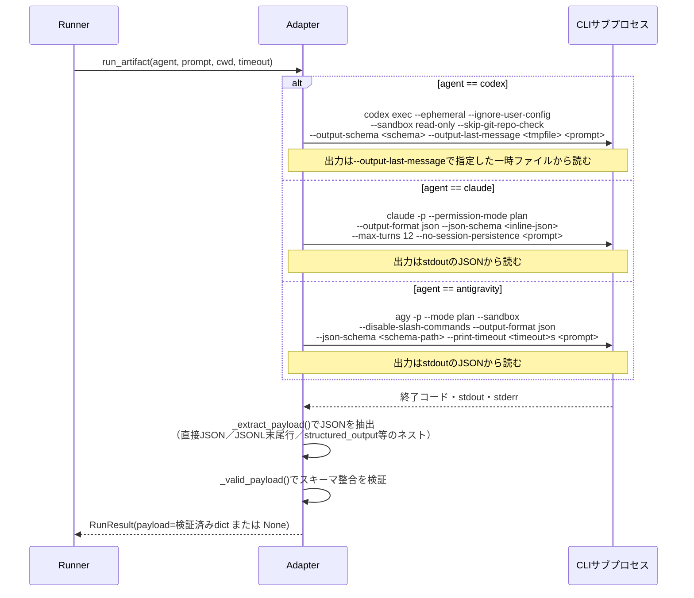
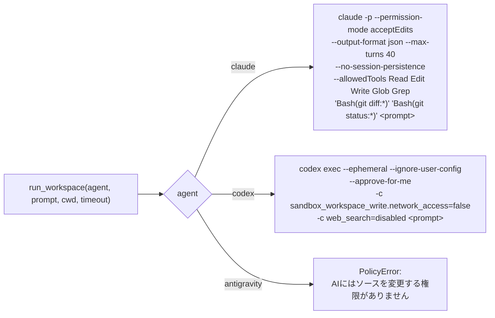
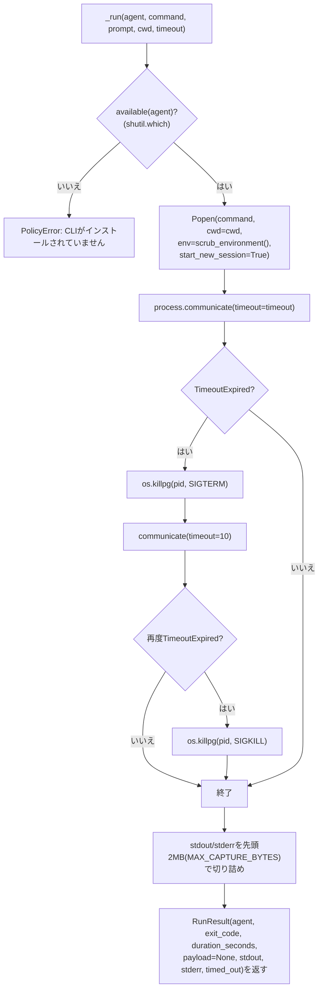

# adapters.py — AI CLIサブプロセスの起動

[← 設計書トップ](index.md)

`triad/adapters.py`の`Adapter`クラスは、Codex・Claude Code・Antigravity（`agy`）という3つの異質なCLIを、共通の`RunResult`型に正規化して呼び出す層である。エージェント固有のコマンドライン引数の組み立て、構造化出力の抽出・検証、サブプロセスのタイムアウト制御、環境変数のスクラビングをすべてここに集約する。`Runner`は「artifact系か workspace系か」だけを意識すればよく、各CLIの引数の違いを知る必要はない。

## クラス図

`Adapter(project_root)`は`contracts/agent-output.schema.json`を読み込んでおき、`run_artifact`が各CLIへスキーマそのもの（またはインライン化したJSON）を渡す。

## run_artifact()（読み取り専用・構造化出力）

3エージェントでコマンド構築が完全に異なる。

`_extract_payload()`は生出力が素直なJSONでない場合に備え、JSONLの末尾行を試したり、`structured_output`/`result`/`output`/`message`といったキーの中にネストされたJSON（文字列またはオブジェクト）を再帰的に探索する。最終的に`{summary, content, verdict, human_decisions}`の4キーが過不足なく揃い、型が正しいものだけを有効なペイロードとして返す（`_valid_payload`）。

## run_workspace()（ワークスペース書き込み）

Antigravityは書き込み権限を持たない（`PolicyError`で拒否）。

Codexの`--approve-for-me`はそれ自体が`workspace-write`サンドボックスを意味し、明示的な`--sandbox`と併用すると引数エラーになる（`docs/research/cli-capabilities.md`に記録した2026-08-19時点のCLI仕様変更に対応済み）。

## _run()（共通サブプロセス実行）

`scrub_environment()`は`OPENAI_API_KEY`等の機密環境変数と`AWS_`等のプレフィックス一致変数を除去したうえで、`TRIAD_AGENT_RUN=1`を必ず設定する。これはCLI側（`triad/cli.py`）が「AI子プロセスからは承認・差し戻し・判断回答を実行できない」ことを判定する唯一の目印である。

## audit_record()

`Runner`は`run_artifact`/`run_workspace`の呼び出しごとに`Adapter.audit_record(task_id, phase, result, prompt)`を呼び、`Store.append_audit()`経由で`.ai-dev/audit/cli-calls.jsonl`へ1行追記する。記録するのは`prompt_sha256`（プロンプト本文のハッシュのみ）・`agent`・`exit_code`・`duration_seconds`・`timed_out`・`structured_output`（payloadの有無）で、プロンプト本文や出力そのものは保存しない。

## 関連ファイル

- 実装: [`triad/adapters.py`](../../../triad/adapters.py)
- 契約: [`contracts/agent-output.schema.json`](../../../contracts/agent-output.schema.json)
- 利用元: [`runner.py`](runner.md)
- 依存: [`policy.py`](policy.md)（`scrub_environment`/`sha256_bytes`）
- 関連調査: [`docs/research/cli-capabilities.md`](../../research/cli-capabilities.md)（3 CLIのバージョン・フラグの一次調査記録）
