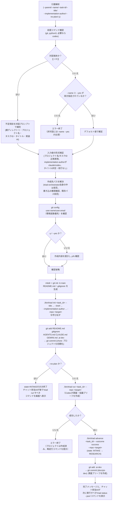
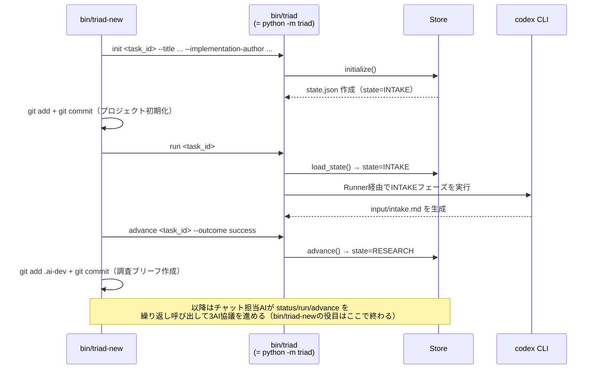

# bin/ — 起動スクリプト

[← 設計書トップ](index.md)

`bin/`配下には2つのBashスクリプトがある。`bin/triad`は既存タスクを操作する薄いシムで、`bin/triad-new`は新しいアプリケーションのGitリポジトリと最初のタスクを一括で作る唯一の場所である。いずれも通常は人間が直接打つのではなく、VS Codeのチャット担当AIが内部で実行する。

## bin/triad（3行のシム）

```bash
export PYTHONPATH="$REPO_DIR${PYTHONPATH:+:$PYTHONPATH}"
exec python3 -m triad "$@"
```

`PYTHONPATH`にプラットフォームのルート（`triad-orchestrator/`）を追加したうえで、受け取った引数をそのまま`python3 -m triad`（実体は[`triad/cli.py`](cli.md)の`main()`）へ`exec`で引き渡す。プロセスを置き換える`exec`なので、シェル自体は残らない。

## bin/triad-new のフロー



## bin/triad-new が bin/triad を複数回呼び出すシーケンス

`--no-plan`を指定しない既定経路では、`bin/triad-new`自身が`bin/triad`を2回呼び出し、その間に`state.json`が2段階で進む。



## 関連ファイル

- 実装: [`bin/triad`](../../../bin/triad)、[`bin/triad-new`](../../../bin/triad-new)
- 呼び出し先: [`cli.py`](cli.md)（`init`/`run`/`advance`サブコマンド）
- テスト: [`tests/test_bootstrap.py`](../../../tests/test_bootstrap.py)（`bin/triad-new`のサブプロセスレベルテスト、`tests/fixtures/bin/codex`の偽実行ファイルでCodex呼び出しをスタブ化）
