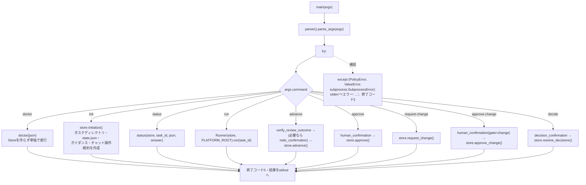
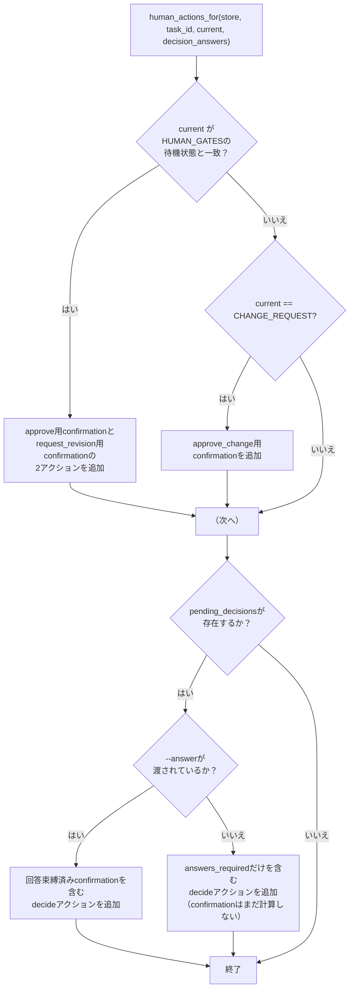
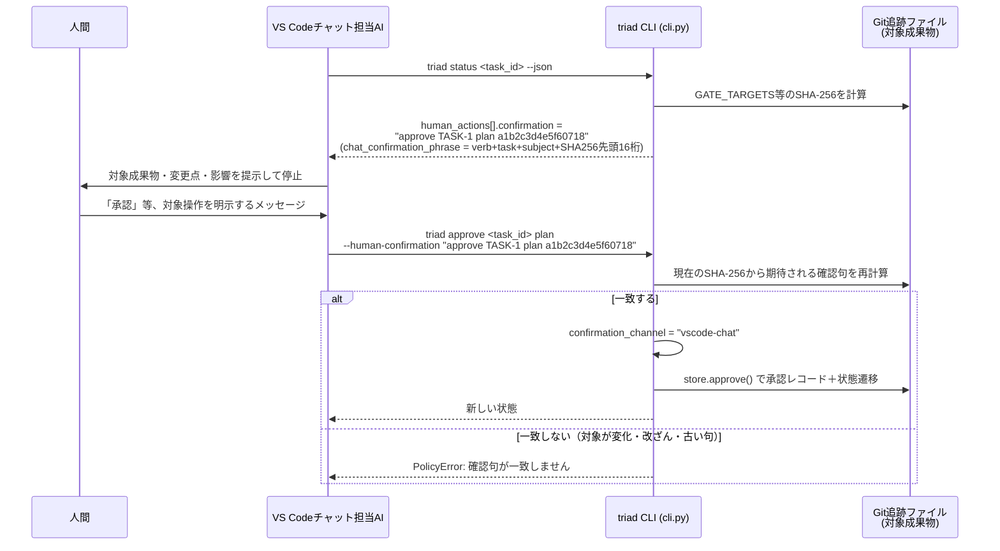

# cli.py — コマンドラインの入口

[← 設計書トップ](index.md)

`triad/cli.py`は`python -m triad`（`bin/triad`経由）で起動される`argparse`ベースのCLIで、9個のサブコマンドを1つの`main()`から振り分ける。VS Codeのチャット担当AI（Codex拡張・Claude Code拡張）がこのCLIを内部で呼び出し、人間には結果だけを提示する——人間が直接このコマンドを打つことは想定していない。承認・差し戻し・判断回答の「人間の明示意思をどう確認するか」というTriad最大の信頼境界も、このファイルに集約されている。

## サブコマンド・ディスパッチ

`doctor`以外の全コマンドはまず`Store(args.repo)`を構築する（`git rev-parse --show-toplevel`が失敗すればここで`PolicyError`）。

## status の human_actions 生成

`status --json`が返す`human_actions`配列が、チャット担当AIに「今、人間から何を引き出せばよいか」を伝える唯一の情報源である。

## 確認句（confirmation phrase）の2段階プロトコル

`approve`・`advance --outcome needs_changes`（差し戻し・作り直し時のみ）・`approve-change`・`decide`の4コマンドが対象。

`--human-confirmation`を省略した場合は対話端末経路にフォールバックし、`sys.stdin/stdout`がTTYであることを要求したうえで平文フレーズ（例:`"approve TASK-1 plan"`）の入力を求める（`confirmation_channel = "terminal"`）。いずれの経路でも、呼び出し元プロセスの環境変数`TRIAD_AGENT_RUN`が`"1"`（`policy.scrub_environment()`がAI子プロセスに必ず設定する値）であれば即座に`PolicyError`で拒否し、AIが自分自身の判断で承認・差し戻し・判断回答を行うことを構造的に防ぐ。

`decide`用の`decision_confirmation()`は、確認句の元になるハッシュ対象に人間の回答文字列そのもの（正規化JSON）も含める。そのため異なる回答を渡すと確認句が一致せず、提示された回答と異なる内容を記録することはできない。

`advance`はさらにスコープを制限する。`--human-confirmation`は`REVISION_GATES`に該当する状態（`AWAITING_PLAN_APPROVAL`/`AWAITING_DELIVERY_APPROVAL`）で`--outcome needs_changes`を指定する場合にだけ許可され、それ以外（通常のフェーズ進行）で指定すると`PolicyError`になる。

## verify_review_outcome()

`advance`実行前に、現在の状態が`review=True`のフェーズであれば、対応するレビュー成果物のYAMLフロントマターにある`verdict:`行を読み、CLIに渡された`--outcome`と一致するかを検証する。一致しなければ`PolicyError`で停止する——レビューAIが成果物本文に書いた判定と、状態遷移に使われる結果が食い違うことを防ぐダブルチェックである。

## サブコマンド一覧

| コマンド | 目的 | 主な引数 |
|---|---|---|
| `doctor` | CLI・認証・Git・Dockerの利用可否を確認 | `--json` |
| `init` | タスクを作成 | `task_id`, `--title`, `--brief`, `--implementation-author` |
| `status` | 状態と次の担当・確認句を表示 | `task_id`, `--json`, `--answer`(複数可) |
| `run` | 現在フェーズのAI/Docker処理を実行 | `task_id` |
| `advance` | 証跡検証のうえ状態遷移 | `task_id`, `--outcome`, `--reason`, `--human-confirmation` |
| `approve` | 承認ゲートを承認 | `task_id`, `gate`(`plan`\|`delivery`), `--human-confirmation` |
| `request-change` | 承認済み計画への変更要求を作成 | `task_id`, `--reason`, `--actor` |
| `approve-change` | 変更要求を承認 | `task_id`, `--human-confirmation` |
| `decide` | 判断待ちへ回答 | `task_id`, `--answer`(複数可・必須), `--human-confirmation` |

運用視点での使い分けは[運用手順](../operations.md#チャット担当aiが使うcli)を参照。

## 関連ファイル

- 実装: [`triad/cli.py`](../../../triad/cli.py)
- 依存: [`model.py`](model.md)、[`store.py`](store.md)、[`runner.py`](runner.md)、[`policy.py`](policy.md)
