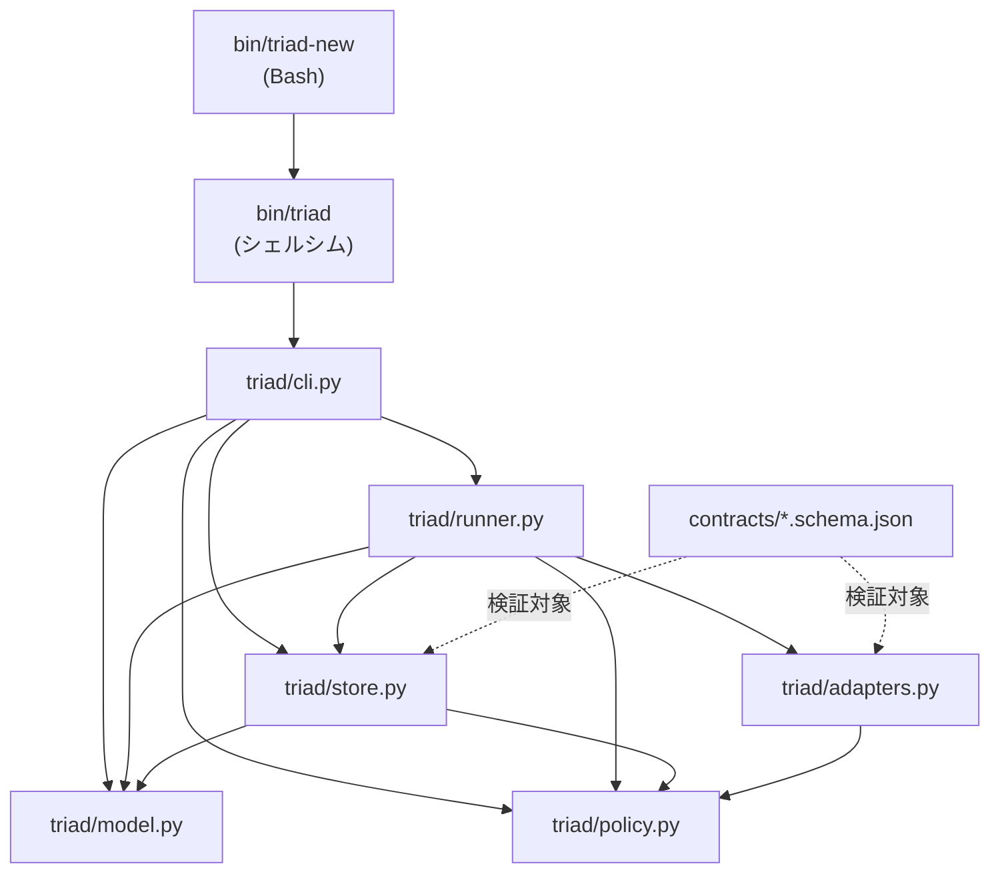
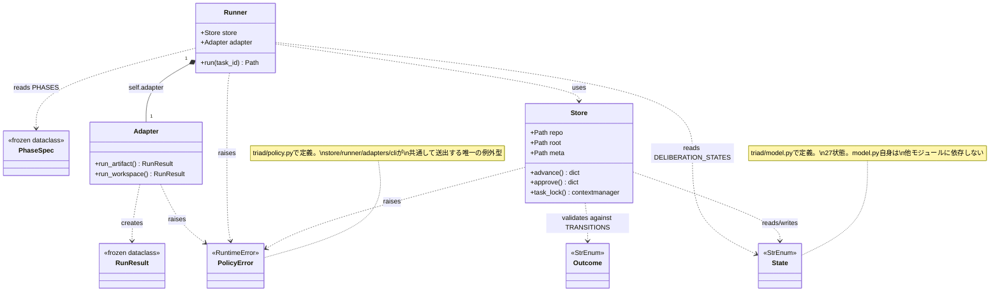
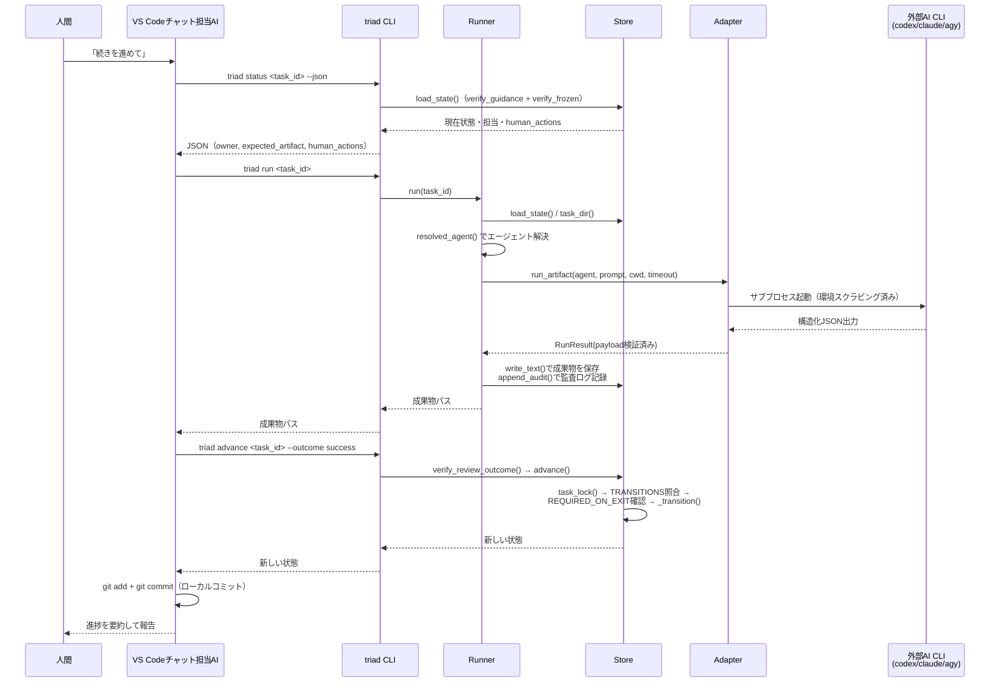
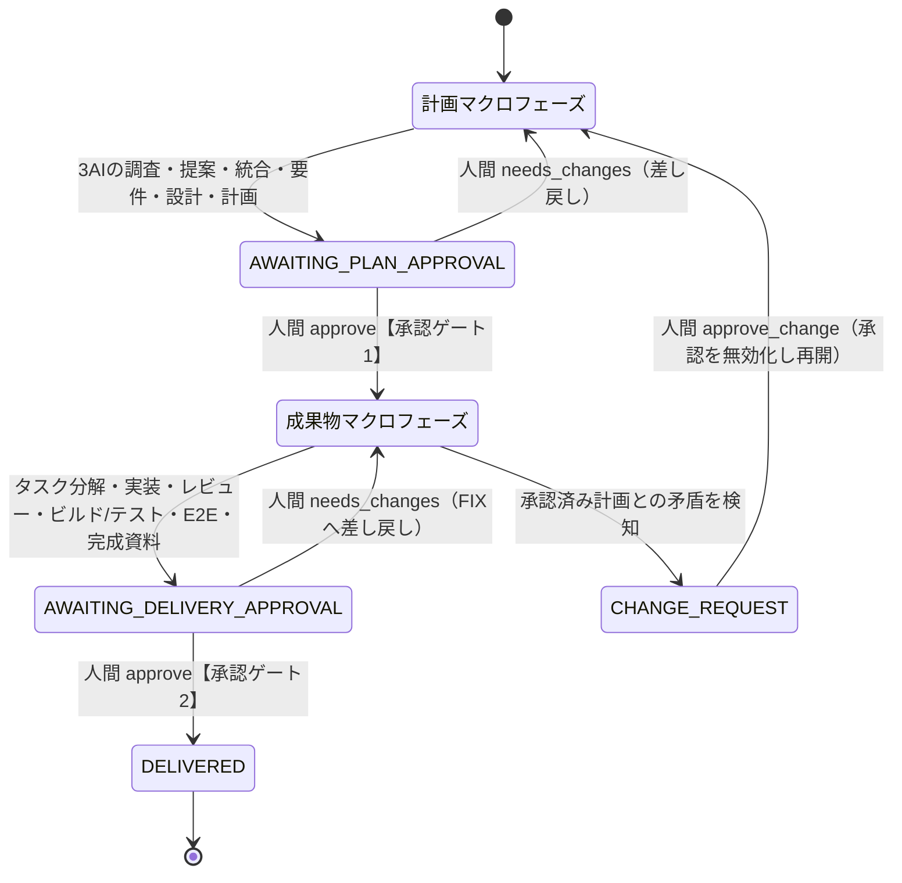
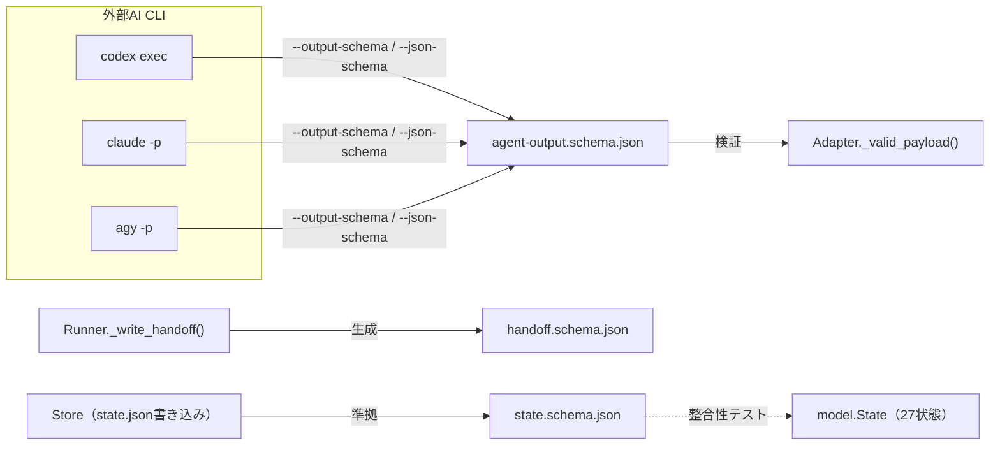

# 実装設計書 — triad/ パッケージ

この文書群は、[アーキテクチャ](../architecture.md)が説明する「なぜこう設計したか」を踏まえたうえで、`triad/`パッケージと`bin/`スクリプトが「実際にどう実装されているか」をモジュール単位のクラス図・フローチャート・シーケンス図で示す実装設計書である。対象はこのオーケストレーター基盤自身のコードであり、個々のアプリケーション実装ではない。

## モジュール一覧

| ファイル | 責務 | 詳細 |
|---|---|---|
| `triad/model.py` | 状態機械の定義（`State`/`Outcome`/`TRANSITIONS`/`PHASES`等）。副作用なし | [model.md](model.md) |
| `triad/store.py` | Gitバックエンドの永続化。状態遷移の検証、ロック、承認記録 | [store.md](store.md) |
| `triad/runner.py` | 現在フェーズのAI・Docker処理を実行するエンジン | [runner.md](runner.md) |
| `triad/adapters.py` | Codex/Claude/AntigravityのCLIサブプロセス起動 | [adapters.md](adapters.md) |
| `triad/policy.py` | セキュリティ・検証ユーティリティ、`PolicyError` | [policy.md](policy.md) |
| `triad/cli.py` | `argparse`ベースのコマンドライン入口、確認句プロトコル | [cli.md](cli.md) |
| `bin/triad` / `bin/triad-new` | CLI起動シム／新規アプリ一括作成スクリプト | [bin.md](bin.md) |

## パッケージ依存関係

`policy.py`は他のどのTriadモジュールにも依存しない末端の共通基盤であり、`model.py`はデータ定義のみで他モジュールに依存しない。`cli.py`が唯一の実行エントリポイントで、`Store`と`Runner`の両方を組み立てて各サブコマンドへ配る。

## クラス関係図

`Store`・`Runner`・`Adapter`はいずれも状態やインスタンスを持たない`model.py`のテーブル（`TRANSITIONS`・`PHASES`・`HUMAN_GATES`等）と、`policy.py`の純粋関数を「参照するだけ」で協調しており、継承関係は存在しない——Triad全体はコンポジション（has-a／uses）中心の薄い層構造である。

## End-to-Endシーケンス（1フェーズぶんの通常サイクル）

チャット担当AI（Codex拡張／Claude Code拡張）が1フェーズを進める際に内部で行う、`status → run → advance`の典型的な1サイクル。

人間承認ゲート（`AWAITING_PLAN_APPROVAL`/`AWAITING_DELIVERY_APPROVAL`）に到達した場合の確認句プロトコルは[cli.md](cli.md#確認句confirmation-phraseの2段階プロトコル)を参照。

## 状態遷移（マクロ視点）

詳細な全27状態の遷移図は[model.md](model.md#状態遷移図全状態全遷移)を参照。ここでは俯瞰用の簡略版のみを示す。

## contracts/ のスキーマ

`contracts/`はコードを持たないJSON Schema（Draft 2020-12）定義であり、`model.py`のテーブル・各CLIの構造化出力・`Runner`が書くファイルの整合性を機械的に保証する契約境界である。

| スキーマ | 検証対象 | 生成元 | 消費元 |
|---|---|---|---|
| `agent-output.schema.json` | 各AI CLIが返す`{summary, content, verdict, human_decisions}` | 外部AI CLI（codex/claude/agy） | [`Adapter._valid_payload`](adapters.md) |
| `handoff.schema.json` | フェーズ開始前に書く引き継ぎ情報 | [`Runner._write_handoff`](runner.md) | （人間・AIが参照する記録） |
| `state.schema.json` | `state.json`（27状態のenumを含む） | [`Store`](store.md)（唯一の書き込み元） | `tests/test_contracts.py`が`model.State`との一致を検証 |

## 関連ドキュメント

- 設計判断の根拠: [アーキテクチャ](../architecture.md)
- 人間向け運用手順: [運用手順](../operations.md)
- 文書全体の構成: [文書案内](../../README.md)
