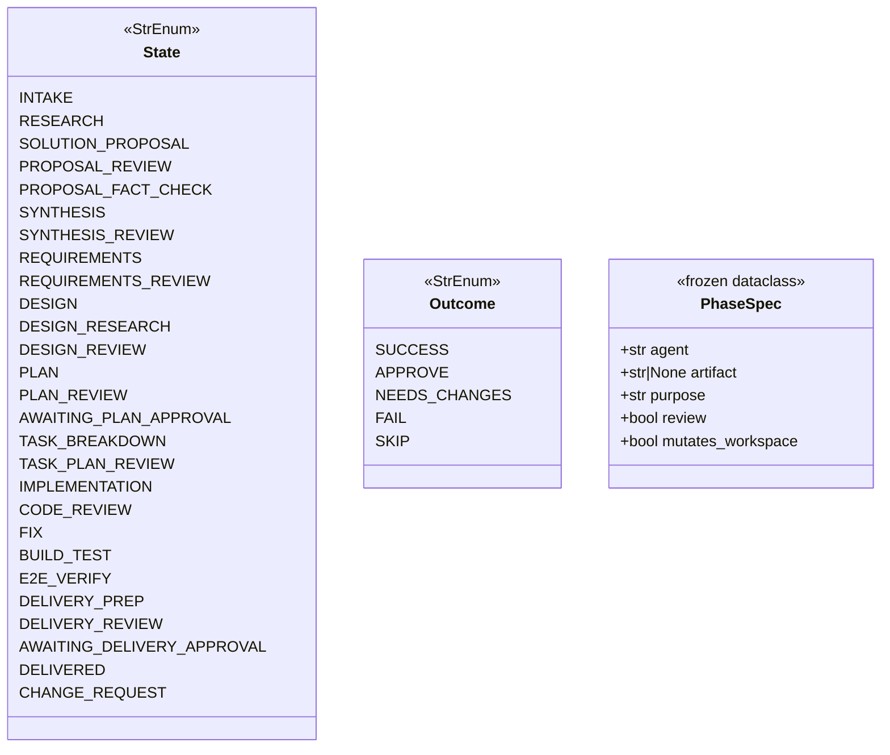
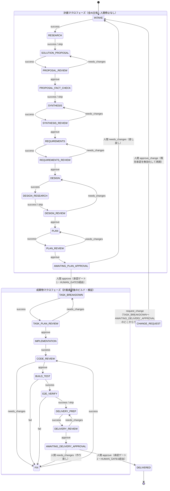
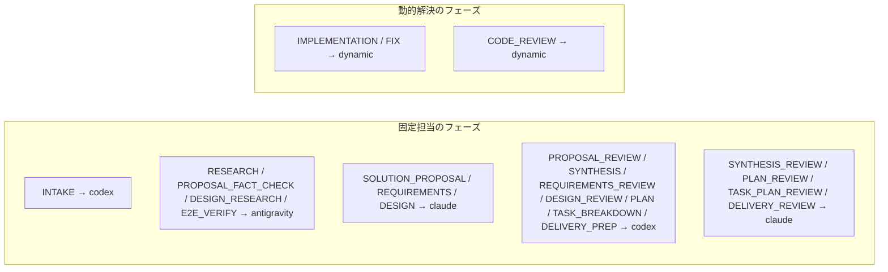
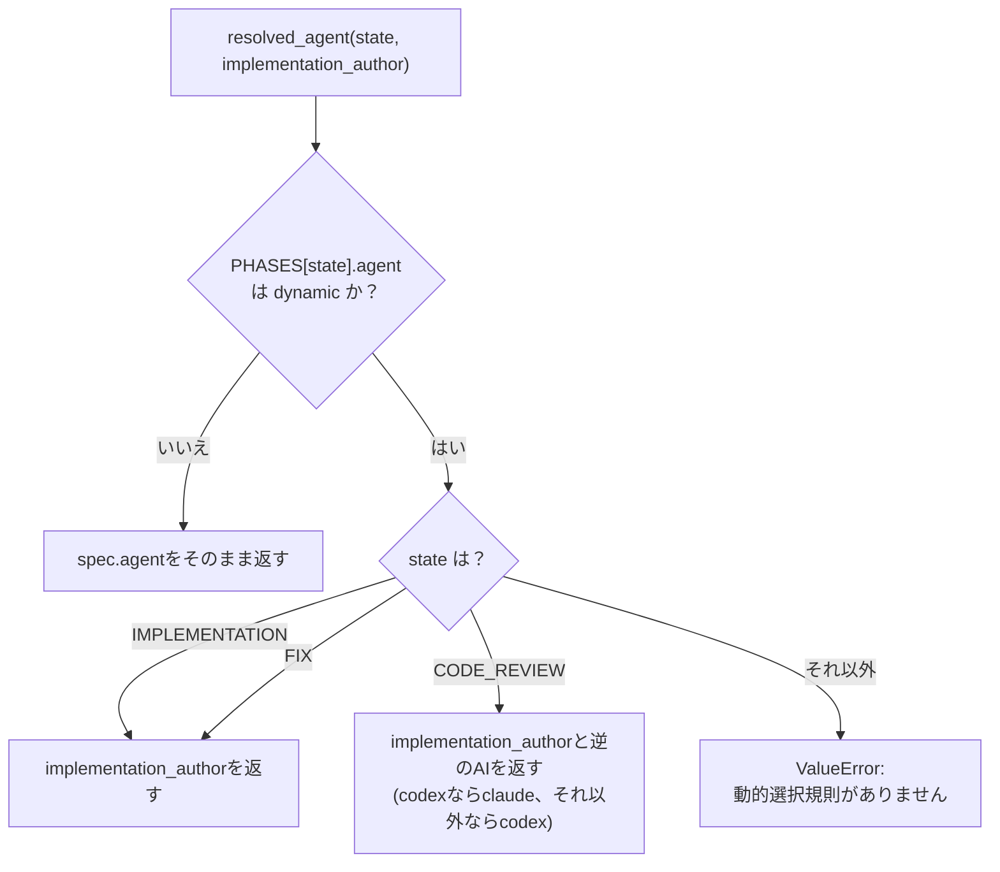

# model.py — 状態機械の定義

[← 設計書トップ](index.md)

`triad/model.py`はTriadの状態機械そのものを表す、副作用を持たない宣言的なデータモジュールである。`State`（状態）と`Outcome`（結果）の2つの列挙型、状態遷移表`TRANSITIONS`、承認ゲート対応表、各状態の担当AIと成果物を表す`PhaseSpec`/`PHASES`、そして実装担当AIを動的に解決する`resolved_agent()`関数を定義する。`Store`と`Runner`はいずれもこのモジュールが持つテーブルを参照するだけで、`model.py`自身はインスタンスを持たない。

## State / Outcome

`State`は27種類（うち26種類は`TRANSITIONS`で通常の状態遷移として直接到達し、`CHANGE_REQUEST`だけは`Store.request_change()`という別経路で到達する側路状態）。`Outcome`は5種類で、`SKIP`だけは`RESEARCH`・`PROPOSAL_FACT_CHECK`・`DESIGN_RESEARCH`・`E2E_VERIFY`の4状態でしか使えないという追加制約が`Store.advance()`側にある（`TRANSITIONS`自体には他の状態でも`SKIP`キーが存在しないため二重に防御されている）。

## 状態遷移図（全状態・全遷移）

`TRANSITIONS`（model.py 45-108行）を1対1でMermaid化したもの。計画マクロフェーズは全てAI主体で人間を止めない。成果物マクロフェーズの末尾で人間の承認ゲート2を経て`DELIVERED`に至る。

補足:

- `AWAITING_PLAN_APPROVAL --> TASK_BREAKDOWN`と`AWAITING_DELIVERY_APPROVAL --> DELIVERED`は`TRANSITIONS`表には存在しない。これらは`Store.approve()`が`HUMAN_GATES`表を参照して直接遷移させる、人間承認専用の経路である。
- `CHANGE_REQUEST`への遷移は`TRANSITIONS`表の外にあり、`Store.request_change()`内のハードコードされた許可リスト（計画マクロフェーズと`AWAITING_PLAN_APPROVAL`・`CHANGE_REQUEST`・`DELIVERED`を除く全状態）で判定する。
- `CHANGE_REQUEST --> INTAKE`は`Store.approve_change()`が行う。既存の`approvals`をすべて`superseded_approvals`へ退避し、空にしてから遷移する。

## 承認ゲート・差し戻し対応表

| テーブル | 内容 |
|---|---|
| `HUMAN_GATES` | ゲート名(`plan`/`delivery`) → (待機状態, 承認後の遷移先)。`plan`: `AWAITING_PLAN_APPROVAL`→`TASK_BREAKDOWN`。`delivery`: `AWAITING_DELIVERY_APPROVAL`→`DELIVERED`。 |
| `REVISION_GATES` | 待機状態 → ゲート名。差し戻しフィードバックファイル名（`plan-feedback-NNN.md`等）の決定に使う。 |
| `GATE_TARGETS` | ゲート名 → 固定対象の相対パス一覧。`plan`は14件（`input/intake.md`〜`reviews/plan-review.md`）、`delivery`は7件（`artifacts/task-plan.md`〜`reviews/delivery-review.md`）。承認時にこれら全てのSHA-256を承認記録へ焼き付ける。 |
| `REQUIRED_ON_EXIT` | 各状態 → その状態を抜けるために存在すべき成果物パス。`PHASES`の`artifact`から自動生成し、`BUILD_TEST`だけ`evidence/build-test.md`を手動追加。 |
| `DELIBERATION_STATES` | 計画マクロフェーズ14状態（`INTAKE`〜`PLAN_REVIEW`）のfrozenset。この間は`human_decisions`を空にしなければならない。 |

## PhaseSpec / PHASES

各状態に対応する`PhaseSpec(agent, artifact, purpose, review, mutates_workspace)`を`PHASES`辞書で保持する。`agent`が`"dynamic"`の状態（`IMPLEMENTATION`・`CODE_REVIEW`・`FIX`）だけは`resolved_agent()`で実行時に解決する。

## resolved_agent() の解決ロジック

`CODE_REVIEW`で実装者と逆のAIを選ぶことで、自作コードの自己レビューを構造的に防いでいる。`implementation_author`は`state.json`に固定され、タスク作成時（`init`）に`claude`または`codex`のいずれかで確定する。

## 関連ファイル

- 実装: [`triad/model.py`](../../../triad/model.py)
- 参照元: [`triad/store.py`](store.md)（`TRANSITIONS`/`HUMAN_GATES`/`REVISION_GATES`/`GATE_TARGETS`/`REQUIRED_ON_EXIT`）、[`triad/runner.py`](runner.md)（`PHASES`/`DELIBERATION_STATES`/`resolved_agent`）
- 契約: [`contracts/state.schema.json`](../../../contracts/state.schema.json)が`State`と同じ27種類の`enum`を持つ（`tests/test_contracts.py`が一致を検証）
