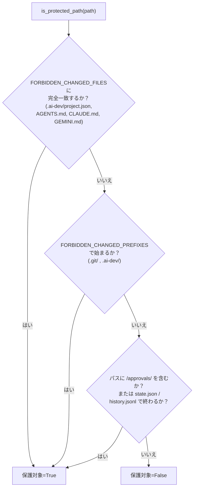
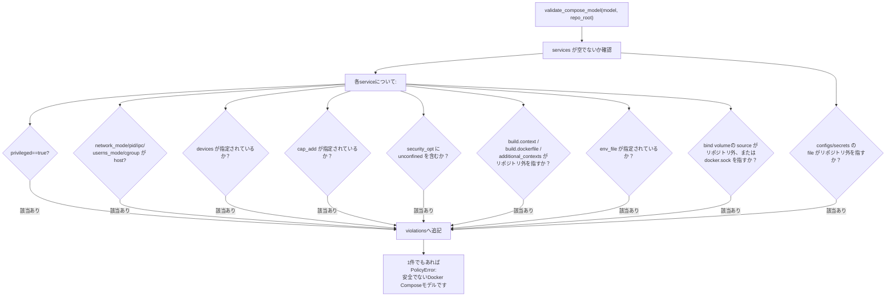
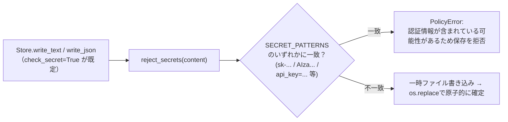

# policy.py — セキュリティ・検証ユーティリティ

[← 設計書トップ](index.md)

`triad/policy.py`はクラスを持たない純粋関数の集まりで、Triad全体で使う唯一の例外型`PolicyError`もここに定義する。ハッシュ計算、環境変数のスクラビング、保護パス判定、シークレット検出、Docker Compose設定の安全性検証という5系統の責務を持つ。`Store`・`Runner`・`Adapter`・`cli.py`のすべてがこのモジュールの関数を呼ぶが、`policy.py`自身は他のTriadモジュールに依存しない（末端の共通基盤）。

## 提供関数一覧

| 関数 | 用途 |
|---|---|
| `sha256_bytes(value)` / `sha256_file(path)` | バイト列・ファイルのSHA-256を計算する。承認固定・監査ログ・確認句の全てで使用。 |
| `scrub_environment(source=None)` | `SENSITIVE_ENV_NAMES`（APIキー・トークン・Docker/Kubeコンテキスト等）と`SENSITIVE_ENV_PREFIXES`（`AWS_`/`AZURE_`/`GOOGLE_`/`GCP_`/`KUBE_`/`CI_JOB_TOKEN`）に一致する環境変数を除去し、`TRIAD_AGENT_RUN=1`を設定して返す。 |
| `is_protected_path(raw)` | 単一パスが保護対象か判定する（`FORBIDDEN_CHANGED_FILES`完全一致／`.git/`・`.ai-dev/`プレフィックス／`/approvals/`を含む／`state.json`か`history.jsonl`で終わる）。 |
| `validate_changed_paths(paths)` | パス一覧のうち1件でも`is_protected_path`に該当すれば`PolicyError`。 |
| `reject_secrets(text)` | `SECRET_PATTERNS`（`sk-...`、`AIza...`、`api_key=...`等の正規表現）に一致すれば書き込みを拒否する。 |
| `reject_compose_override_files(root)` | `compose.override.yaml`等のオーバーライドファイルの存在自体を拒否する。 |
| `validate_compose_model(model, repo_root)` | `docker compose config`が解決した後のモデルに対する詳細な安全性検証。 |

## validate_changed_paths() / is_protected_path() の判定

`_workspace_run`は使い捨てクローン内での改変検出（`_protected_drift`）と、実際にリポジトリへ反映する変更パス一覧の両方にこの判定を適用する二重チェックになっている。

## validate_compose_model() の禁止項目

`_build_test`が`docker compose config`で解決した後のモデル（環境変数展開・オーバーライドマージ済み）に対して行う検証で、生のYAMLキー走査（`_preflight_compose_files`）では検出できない、マージ後にしか現れない危険設定を捕捉する。

`_within_root()`が「パスがリポジトリルート配下に解決されるか」を`Path.resolve()`で判定する共通ヘルパーである。

## reject_secrets() の書き込み前スキャン

`_build_test`の証跡書き込み（`evidence/build-test.md`）も同じ関数をDockerの標準出力／標準エラーへ適用してから保存する。

## 関連ファイル

- 実装: [`triad/policy.py`](../../../triad/policy.py)
- 利用元: [`store.py`](store.md)、[`runner.py`](runner.md)、[`adapters.py`](adapters.md)、[`cli.py`](cli.md)（`sha256_bytes`/`sha256_file`）
