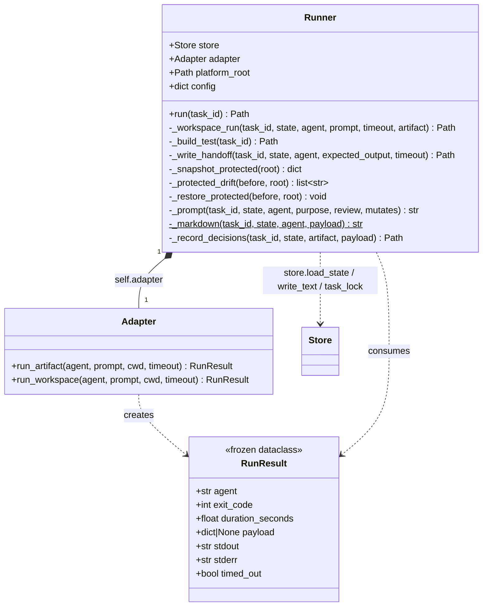
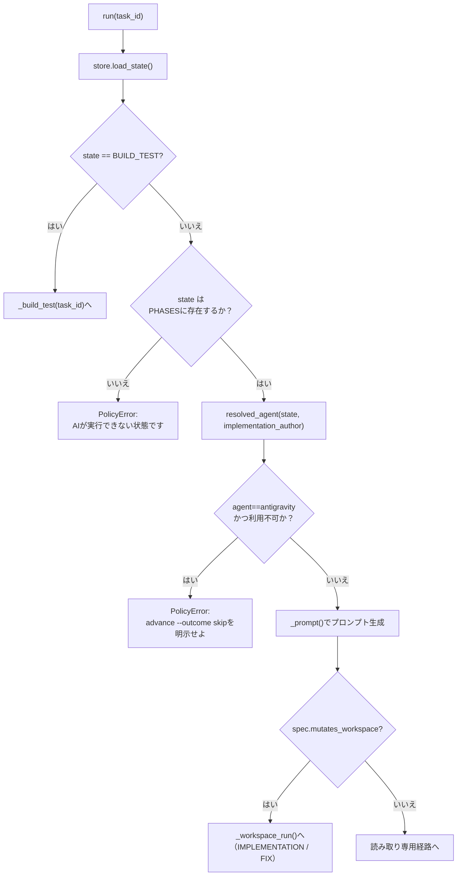
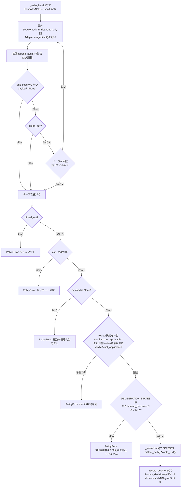
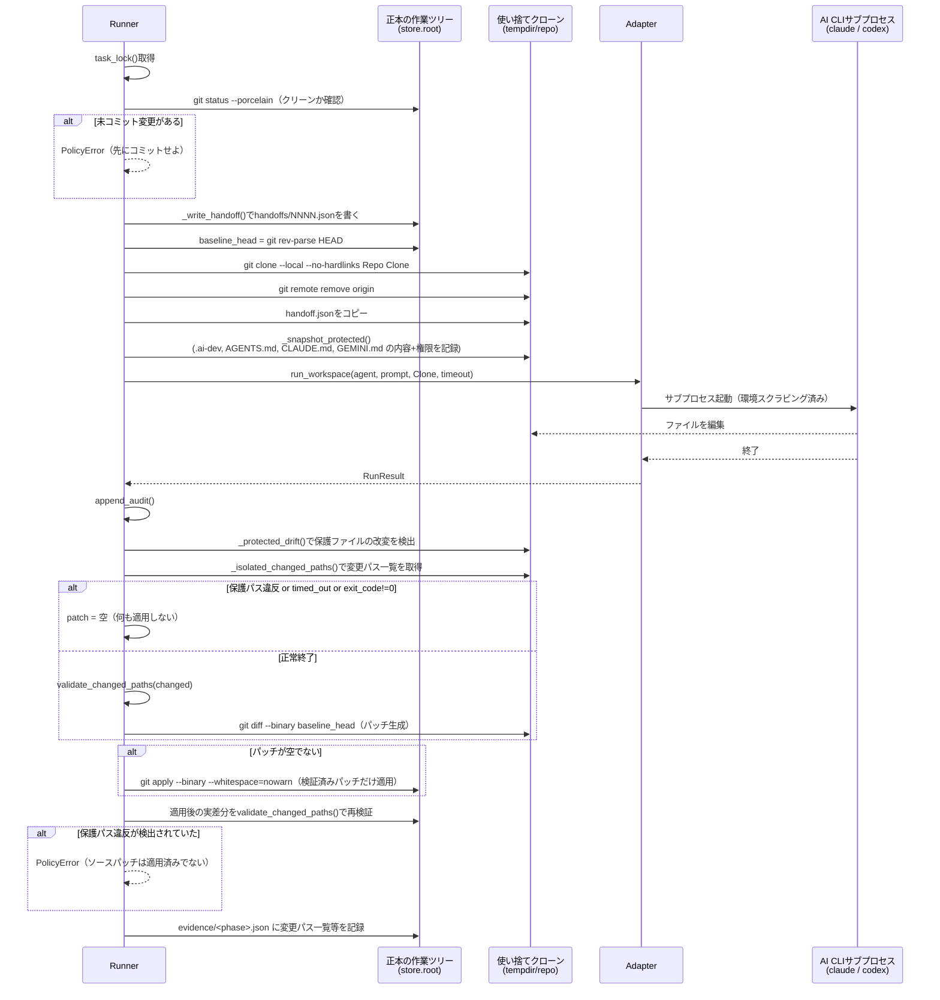
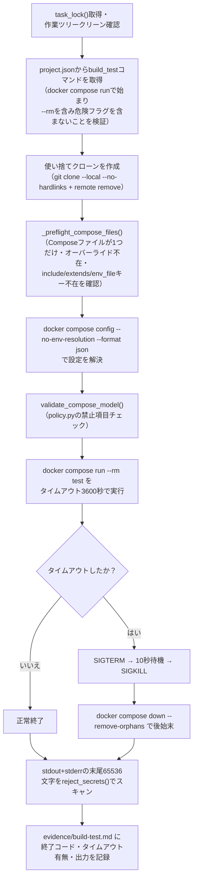

# runner.py — フェーズ実行エンジン

[← 設計書トップ](index.md)

`triad/runner.py`の`Runner`クラスは、現在の状態に割り当てられたAIまたはDocker処理を実際に実行する。`Store`が「何を・いつ」遷移させるかを管理するのに対し、`Runner`は「どう実行するか」を担う。読み取り専用の成果物作成（`Adapter.run_artifact`）、ワークスペースを書き換える実装・修正（`_workspace_run`）、Docker Composeによるビルド・テスト（`_build_test`）の3系統の実行経路を持つ。

## クラス図

`Runner(store, platform_root)`のコンストラクタは`Adapter(platform_root)`を内部で生成し、`config/agents.json`（エージェントごとのタイムアウト秒数・自動リトライ回数）を読み込む。

## run() のディスパッチ

### 読み取り専用経路（成果物作成・レビューフェーズ）

## _workspace_run()（使い捨てクローンによる実行境界）

`IMPLEMENTATION`・`FIX`はソースツリーを書き換える唯一のフェーズである。AIの子プロセスが正本の作業ツリーを直接触ることは一度もなく、必ず使い捨てのローカルクローンの中で実行される。

保護対象（`.ai-dev/`配下・`AGENTS.md`・`CLAUDE.md`・`GEMINI.md`・`approvals/*`・`state.json`・`history.jsonl`）が使い捨てクローン内で変更された場合、`git apply`自体を行わない（パッチを丸ごと破棄する）ため、正本の作業ツリーには一切影響しない。クローンはテンポラリディレクトリごと関数を抜けた時点で自動的に削除される。

## _build_test()（Docker Composeによる検証）

## 保護パスのスナップショット/ドリフト検出

`_snapshot_protected()`は使い捨てクローン内の`.ai-dev/`配下および`AGENTS.md`・`CLAUDE.md`・`GEMINI.md`の内容とパーミッションを実行前に記録する。`_protected_drift()`は実行後に同じ集合を再取得し、内容が変化したパスの一覧を返す。1件でもあれば`_workspace_run`はパッチ適用そのものを取りやめる。`_restore_protected()`はテスト・障害復旧用のヘルパーで、記録済みのスナップショットへ内容とパーミッションを書き戻す。

## プロンプト生成 `_prompt()`

各AI呼び出しのプロンプトは`_prompt()`が動的に組み立てる。フェーズの`purpose`に加え、次の3種のルールを状態に応じて切り替えて埋め込む。

| ルール | 分岐条件 | 内容 |
|---|---|---|
| `verdict_rule` | `spec.review` | レビューなら`approve`/`needs_changes`必須、非レビューなら`not_applicable`必須 |
| `mutation_rule` | `spec.mutates_workspace` | 書き込み許可（`.ai-dev`等は編集禁止、build/test/commit禁止）か、完全読み取り専用か |
| `decision_rule` | `state in DELIBERATION_STATES` | 計画マクロフェーズ中は質問で停止禁止（仮定・選択肢・リスクを本文へ）、それ以外は重要事項のみ`human_decisions`へ |

プロンプトは「Git追跡ファイルだけが共有文脈であり、他AIの非公開チャットやセッションを使わないこと」「承認済み成果物のハッシュは不変であり、変更が必要なら停止してhuman_decisionsへ記載すること」を毎回明示する。

## 関連ファイル

- 実装: [`triad/runner.py`](../../../triad/runner.py)
- 依存: [`adapters.py`](adapters.md)（`Adapter`/`RunResult`）、[`model.py`](model.md)（`PHASES`/`DELIBERATION_STATES`/`resolved_agent`）、[`policy.py`](policy.md)（`is_protected_path`/`validate_changed_paths`/`validate_compose_model`等）、[`store.py`](store.md)
