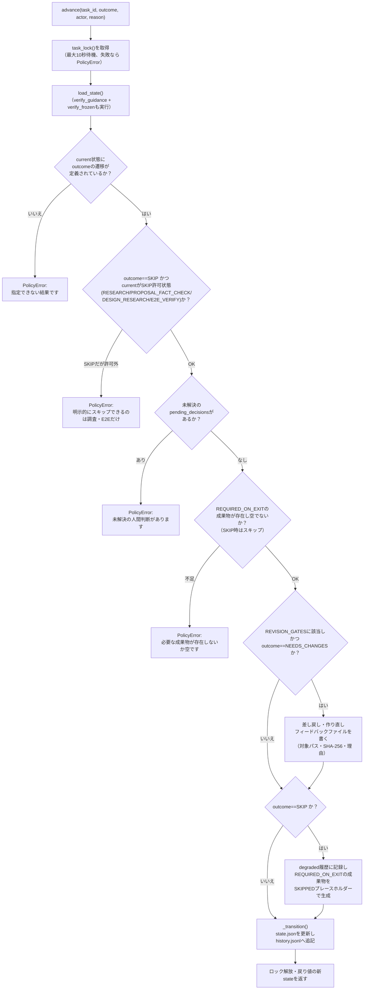
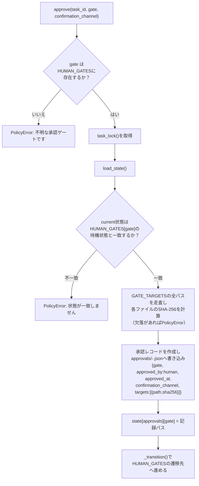
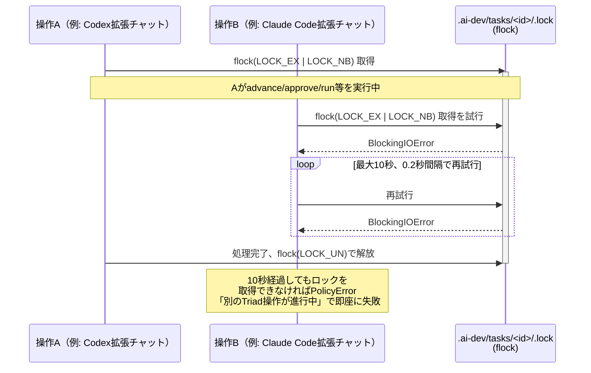
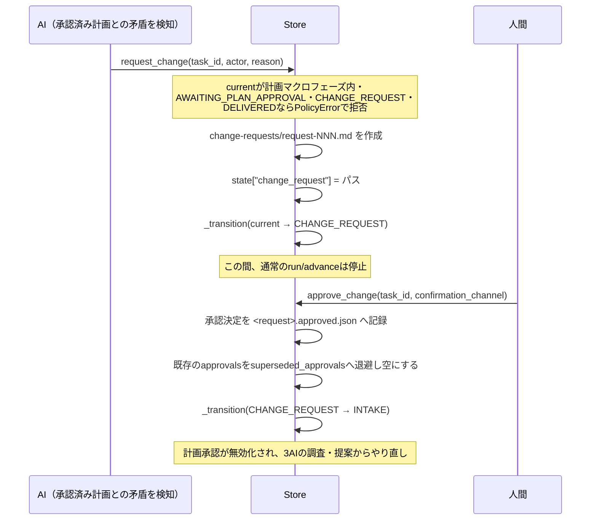

# store.py — Gitバックエンドの永続化層

[← 設計書トップ](index.md)

`triad/store.py`の`Store`クラスは、タスクの状態・履歴・承認記録・判断記録をGit追跡下のファイルとして読み書きする、Triadの唯一の永続化窓口である。状態遷移の正当性検証（`model.TRANSITIONS`との照合）、タスク単位のロック、承認済み成果物のハッシュ固定・検証もここに集約する。`Runner`はAIやDockerを実行するだけで、状態や承認記録への書き込みは必ず`Store`経由で行う。

## クラス図

```mermaid
classDiagram
    class Store {
        +Path repo
        +Path root
        +Path meta
        +task_dir(task_id) Path
        +task_lock(task_id, timeout) contextmanager
        +initialize(task_id, title, implementation_author, ...) dict
        +load_state(task_id, verify_frozen) dict
        +current(task_id) State
        +advance(task_id, outcome, actor, reason, confirmation_channel) dict
        +approve(task_id, gate, confirmation_channel) dict
        +request_change(task_id, actor, reason) Path
        +approve_change(task_id, confirmation_channel) dict
        +resolve_decisions(task_id, answers, confirmation_channel) Path
        +pending_decisions(task_id, phase) list~Path~
        +verify_frozen(state) void
        +verify_guidance() void
        +install_guidance(sources) Path
        +install_chat_interface(source) void
        +artifact_path(task_id, relative) Path
        +append_history(...) void
        +append_audit(record) void
        +write_text(path, content, check_secret)$ void
        +write_json(path, value, check_secret)$ void
    }
    class PolicyError {
        <<RuntimeError>>
    }
    Store ..> PolicyError : raises
    Store ..> "model.TRANSITIONS/HUMAN_GATES/\nREVISION_GATES/GATE_TARGETS/\nREQUIRED_ON_EXIT" : reads
```

`repo`はコンストラクタ引数、`root`は`git rev-parse --show-toplevel`で解決したリポジトリ直下、`meta`は`root/.ai-dev`である。`Store`はタスクIDごとの状態を`.ai-dev/tasks/<task_id>/`配下に持ち、`state.json`・`history.jsonl`・`input/`・`artifacts/`・`reviews/`・`evidence/`・`approvals/`・`change-requests/`・`handoffs/`・`decisions/`の各サブディレクトリを`initialize()`で作成する。

## advance() のフロー

`advance`は現在の状態から`Outcome`に応じて次の状態へ進める、最も頻繁に呼ばれる操作である。



## approve() のフロー



以後`load_state()`を呼ぶたびに`verify_frozen()`がこの`targets`の全SHA-256を再計算し、1件でも変化・欠落していれば`PolicyError`で停止する（「承認済み成果物が変更されています」）。これが承認の完全性を担保する仕組みである。

## task_lock() の排他制御



`.lock`ファイル自体はGit追跡対象外（`initialize()`が対象リポジトリの`.gitignore`へ`.ai-dev/tasks/*/.lock`を冪等に追記する）。`Runner`のワークスペース書き込み（`_workspace_run`）と`BUILD_TEST`実行も同じロックの中で行われる。

## request_change / approve_change（変更要求の側路）



## verify_frozen() / verify_guidance()

`load_state(task_id, verify_frozen=True)`（既定）は状態を読み込むたびに次の2つを検証する。

- **`verify_guidance()`**: `.ai-dev/guidance/manifest.json`に記録したファイル構成・SHA-256と、現在の`.ai-dev/guidance/`配下の実ファイルを比較する。1件でも変更・欠落・追加があれば`PolicyError`。
- **`verify_frozen(state)`**: `state["approvals"]`に記録された各ゲートの承認レコードを読み、その`targets`（`GATE_TARGETS`のSHA-256一覧）を現在のファイルと再計算・比較する。不一致なら「承認済み成果物が変更されています。人間が承認する変更要求を作成してください」で停止する。

## write_text / write_json（原子的書き込み）

両者とも同じパターンを使う。`check_secret=True`（既定）のとき`policy.reject_secrets()`で書き込み内容を正規表現スキャンし、APIキーらしき文字列を検出したら`PolicyError`で書き込みを拒否する。実際の書き込みは同一ディレクトリへの一時ファイル作成 → `os.replace()`によるアトミックな置換で行い、書き込み途中の不完全なファイルが正本として観測されることを防ぐ。

## 関連ファイル

- 実装: [`triad/store.py`](../../../triad/store.py)
- 依存: [`model.py`](model.md)（状態機械の定義）、[`policy.py`](policy.md)（`PolicyError`/`sha256_file`/`reject_secrets`）
- 利用元: [`triad/runner.py`](runner.md)（`task_lock`/`load_state`/`write_text`/`write_json`/`append_audit`）、[`triad/cli.py`](cli.md)（全サブコマンド）
