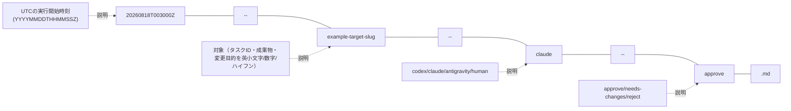
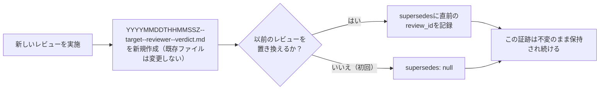

# レビュー証跡の規約

レビュー回数を表す`first`、`second`、`final`は使わない。回数は増え続け、後から「最終」が最終でなくなるためである。ファイル名は、発生時刻、対象、レビュアー、判定で一意にする。

## ファイル名

```text
YYYYMMDDTHHMMSSZ--<target-slug>--<reviewer>--<verdict>.md
```



- 時刻はUTCの実行開始時刻とする。
- `target-slug`はタスクID、成果物、変更目的などを英小文字・数字・ハイフンで表す。
- `reviewer`は`codex`、`claude`、`antigravity`、`human`のいずれかとする。
- ファイル名の`verdict`は`approve`、`needs-changes`、`reject`のいずれかとする。
- 同一秒に同じ対象をレビューする場合だけ、時刻の後ろへ`-01`、`-02`を付ける。

既存4件は正確な時刻を記録していなかったため、移行時に限り`YYYY-MM-DD--<target>--<reviewer>--<verdict>.md`形式を使用している。

## 必須メタデータ

```yaml
---
review_id: REV-20260818T003000Z-example
reviewer: claude-code
reviewed_author: codex
reviewed_target: commit-or-artifact
baseline_sha: git-commit-or-file-sha256
verdict: approve
reviewed_at: 2026-08-18T00:30:00Z
supersedes: null
---
```

本文には、対象範囲、確認方法、重大度別の指摘、確認済み事項、残存リスク、判定を記録する。指摘には場所、根拠、影響、必要な対応を含める。

## 追記方針

- レビュー済み証跡は原則として変更しない。
- 再レビューは新しいファイルを作成し、`supersedes`で直前のレビューIDを参照する。
- `approve`は指摘が一切ないことではなく、未解決のBlockerまたはMajorがないことを意味する。
- レビュー担当は、同じレビューステップで対象コードを修正しない。



タスク内の`requirements-review.md`や`code-review.md`は、状態機械が参照する「現在の正本」なので固定名を使用し、更新履歴はGitで保持する。基盤自身のレビューや、履歴を独立ファイルとして残すレビューには本規約を適用する。
